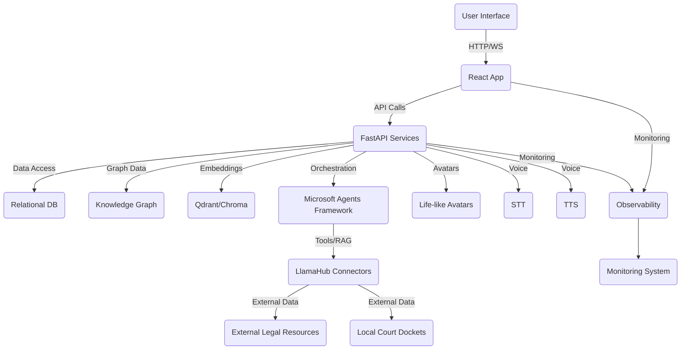

# Implementation Plan: Automated Legal Discovery Co-Counsel Platform

## Overview
This plan outlines the implementation roadmap for the "Automated Legal Discovery Co-Counsel Platform," an AI-powered legal tech solution designed to assist both self-represented litigants and law firms. The platform aims to streamline legal discovery, enhance research capabilities, provide robust evidence management, and offer strategic AI tools within a visually stunning and intuitive user interface.

## Requirements Summary
- End-to-end discovery ingestion with support for folder uploads and asynchronous processing.
- Forensics suite for document authentication and forgery detection.
- Digital evidence binder builder.
- Integration with external legal resources (e.g., CourtListener.com) for case law.
- Contextual legal reasoning with citations (hybrid vector + graph retrieval).
- Automated court calendar and deadline tracking via local court dockets.
- AI-powered legal theory engine, Cypher query builder, and document/motion drafting.
- Interactive timeline, knowledge graph explorer, Trial University, and Mock Trial Arena.
- Visually stunning, cinematic dark-mode UI.
- Robust non-functional requirements including performance, security, reliability (self-healing), scalability, maintainability, usability, and observability.
- All modules to utilize AI.

## Research Findings
### Best Practices
- **Modular Architecture:** For maintainability and extensibility, a modular architecture is crucial, allowing independent development and deployment of components (e.g., microservices for backend, component-based frontend).
- **AI Ethics and Explainability:** Given the legal domain, ensuring transparency, fairness, and explainability in AI outputs (e.g., "cite or silence" policy) is paramount.
- **Security by Design:** Implementing security measures from the outset, including data encryption, access controls, and regular security audits.
- **Scalable Data Ingestion:** Utilizing message queues and distributed processing for efficient handling of large volumes of legal documents.
- **User-Centric Design:** Prioritizing intuitive UI/UX, especially for self-represented litigants, while offering advanced features for legal professionals. The detailed design factors in `new_gui_design_factors.txt` will be a core reference.
- **Observability:** Implementing comprehensive logging, tracing, and monitoring from day one to ensure system health and performance.

### Reference Implementations
- **Microsoft Agents Framework SDK:** The PRD explicitly mentions this for orchestration, workflow graphs, memory, and telemetry. This will be the primary reference for agentic system design.
- **LlamaIndex Core + LlamaHub Connectors:** For RAG and data loading, LlamaIndex documentation and examples will be key.
- **Neo4j & GraphRAG:** Neo4j documentation and existing GraphRAG implementations will guide knowledge graph construction and querying.
- **OpenAvatarChat (`https://github.com/HumanAIGC-Engineering/OpenAvatarChat`):** This will serve as a direct reference for implementing life-like avatars.
- **React, TailwindCSS, shadcn/ui, Framer Motion:** The `new_gui_design_factors.txt` provides detailed guidance and specific component references for the frontend.

### Technology Decisions
- **Backend Framework:** FastAPI (Python) for its performance, async capabilities, and ease of building APIs for AI services.
- **Frontend Framework:** React (Next.js/Vite) with TypeScript, utilizing TailwindCSS, shadcn/ui, and Framer Motion for a cinematic, premium-grade dark-mode interface.
- **Database:** PostgreSQL for relational data, Neo4j for the knowledge graph, and Qdrant/Chroma for vector storage.
- **Orchestration:** Microsoft Agents Framework SDK.
- **AI/RAG:** LlamaIndex core + LlamaHub connectors.
- **Voice:** Whisper STT and Coqui TTS (as per original PRD, though voice aspect was removed from risks/dependencies, the tech stack remains relevant for voice features).
- **Deployment:** Docker Compose for local development and containerization.

## Implementation Tasks

### Phase 1: Foundation & Core Infrastructure
1.  **Project Setup & Repository Initialization**
    *   Description: Set up the monorepo structure, initialize Git, and configure basic project files for backend, frontend, and shared components.
    *   Files to modify/create: `.gitignore`, `README.md`, `package.json` (frontend), `requirements.txt` (backend), `docker-compose.yml`.
    *   Dependencies: None
    *   Estimated effort: 2 days
2.  **Core Backend Service (FastAPI) Setup**
    *   Description: Initialize the FastAPI application, define basic API structure, and set up environment configuration.
    *   Files to modify/create: `backend/app/main.py`, `backend/requirements.txt`, `backend/Dockerfile`.
    *   Dependencies: Task 1
    *   Estimated effort: 3 days
3.  **Core Frontend Application (React/Next.js) Setup**
    *   Description: Initialize the React application with TypeScript, TailwindCSS, and shadcn/ui. Configure basic routing and theming (dark mode).
    *   Files to modify/create: `frontend/package.json`, `frontend/tailwind.config.ts`, `frontend/src/App.tsx`, `frontend/index.html`, `frontend/Dockerfile`.
    *   Dependencies: Task 1
    *   Estimated effort: 4 days
4.  **Database Setup (PostgreSQL, Neo4j, Vector DB)**
    *   Description: Set up Docker Compose configurations for PostgreSQL, Neo4j, and a chosen vector database (Qdrant/Chroma). Define initial schemas.
    *   Files to modify/create: `docker-compose.yml`, `infra/migrations/init.sql` (PostgreSQL), Neo4j configuration.
    *   Dependencies: Task 1
    *   Estimated effort: 5 days
5.  **Basic Authentication & User Management**
    *   Description: Implement basic user registration, login, and session management for both litigant and law firm personas.
    *   Files to modify/create: `backend/app/auth/`, `frontend/src/components/Auth/`, database schema.
    *   Dependencies: Task 2, Task 3, Task 4
    *   Estimated effort: 7 days
6.  **OpenTelemetry & Observability Integration**
    *   Description: Integrate OpenTelemetry for tracing, logging, and metrics across backend and frontend services.
    *   Files to modify/create: `backend/app/main.py`, `frontend/src/main.tsx`, `infra/otel-collector-config.yaml`.
    *   Dependencies: Task 2, Task 3
    *   Estimated effort: 5 days

### Phase 2: Discovery & Evidence Management
1.  **Document Ingestion Service (LlamaHub Integration)**
    *   Description: Implement the backend service for document ingestion, utilizing LlamaHub connectors. Support various document types.
    *   Files to modify/create: `backend/app/ingestion/`, `backend/requirements.txt`.
    *   Dependencies: Phase 1 Completion
    *   Estimated effort: 8 days
2.  **Folder/Directory Upload Frontend Component**
    *   Description: Develop a frontend component for selecting and uploading entire folders/directories.
    *   Files to modify/create: `frontend/src/components/Upload/`.
    *   Dependencies: Phase 1 Completion
    *   Estimated effort: 4 days
3.  **Asynchronous & Multi-threaded Ingestion Pipeline**
    *   Description: Design and implement the backend pipeline for asynchronous and multi-threaded document processing (chunking, embedding, metadata extraction).
    *   Files to modify/create: `backend/app/ingestion/pipeline.py`, message queue configuration.
    *   Dependencies: Task 1 (Phase 2)
    *   Estimated effort: 10 days
4.  **Vector Store Integration (Qdrant/Chroma)**
    *   Description: Integrate the chosen vector database for storing document embeddings and enabling vector search.
    *   Files to modify/create: `backend/app/vector_store/`.
    *   Dependencies: Task 3 (Phase 2)
    *   Estimated effort: 6 days
5.  **Forensics Suite (Initial Version)**
    *   Description: Implement initial functionalities for document authentication and basic forgery detection.
    *   Files to modify/create: `backend/app/forensics/`.
    *   Dependencies: Task 3 (Phase 2)
    *   Estimated effort: 12 days
6.  **Digital Evidence Binder Builder (Basic)**
    *   Description: Develop core functionality for users to create, organize, and manage digital evidence binders.
    *   Files to modify/create: `backend/app/evidence_binder/`, `frontend/src/components/EvidenceBinder/`.
    *   Dependencies: Task 4 (Phase 2)
    *   Estimated effort: 8 days

### Phase 3: Legal Research & Knowledge
1.  **External Legal Resource Integration (CourtListener.com)**
    *   Description: Implement a service to fetch case law and legal documents from CourtListener.com.
    *   Files to modify/create: `backend/app/legal_research/`.
    *   Dependencies: Phase 1 Completion
    *   Estimated effort: 7 days
2.  **Knowledge Graph Construction (GraphBuilderAgent)**
    *   Description: Implement the GraphBuilderAgent for entity/relation extraction and Cypher upserts to Neo4j.
    *   Files to modify/create: `agents/GraphBuilderAgent.py`, `backend/app/knowledge_graph/`.
    *   Dependencies: Task 3 (Phase 2), Task 1 (Phase 3)
    *   Estimated effort: 10 days
3.  **Hybrid Vector + Graph Retrieval**
    *   Description: Develop the core logic for contextual legal reasoning, combining vector search and knowledge graph traversal.
    *   Files to modify/create: `backend/app/retrieval/`.
    *   Dependencies: Task 4 (Phase 2), Task 2 (Phase 3)
    *   Estimated effort: 10 days
4.  **"Cite or Silence" Policy Enforcement**
    *   Description: Implement mechanisms to ensure AI responses adhere to the "cite or silence" policy, providing citations or indicating insufficient information.
    *   Files to modify/create: `backend/app/ai_policy/`.
    *   Dependencies: Task 3 (Phase 3)
    *   Estimated effort: 5 days
5.  **Simplified Legal Explanations (for Litigants)**
    *   Description: Develop an AI module to provide simplified explanations of legal procedures and concepts.
    *   Files to modify/create: `backend/app/legal_education/`.
    *   Dependencies: Task 3 (Phase 3)
    *   Estimated effort: 6 days

### Phase 4: Case Management & Deadlines
1.  **Local Court Docket Integration**
    *   Description: Implement a service to ping local court dockets and retrieve court dates and deadlines. (Requires research into specific court APIs/data sources).
    *   Files to modify/create: `backend/app/court_calendar/`.
    *   Dependencies: Phase 1 Completion
    *   Estimated effort: 10 days (includes research)
2.  **Automated Alerts & Centralized Court Calendar UI**
    *   Description: Develop backend logic for automated alerts and a frontend component to display a centralized court calendar.
    *   Files to modify/create: `backend/app/alerts/`, `frontend/src/components/CourtCalendar/`.
    *   Dependencies: Task 1 (Phase 4)
    *   Estimated effort: 7 days

### Phase 5: AI & Strategic Tools
1.  **Legal Theory Engine (Initial Version)**
    *   Description: Develop an AI-powered module to assist in generating and evaluating legal theories.
    *   Files to modify/create: `backend/app/legal_theory/`.
    *   Dependencies: Task 3 (Phase 3)
    *   Estimated effort: 12 days
2.  **Automated Cypher Query Builder**
    *   Description: Implement an AI-driven tool to generate Cypher queries based on natural language input for the knowledge graph.
    *   Files to modify/create: `backend/app/cypher_builder/`.
    *   Dependencies: Task 2 (Phase 3)
    *   Estimated effort: 8 days
3.  **AI-Assisted Document & Motion Drafting**
    *   Description: Develop an AI module to assist in drafting legal documents and motions, leveraging retrieved knowledge.
    *   Files to modify/create: `backend/app/document_drafting/`.
    *   Dependencies: Task 3 (Phase 3)
    *   Estimated effort: 10 days

### Phase 6: User Interface & Experience Enhancements
1.  **Interactive Timeline UI**
    *   Description: Develop a frontend component to visualize case events on an interactive timeline, fed by the knowledge graph.
    *   Files to modify/create: `frontend/src/components/Timeline/`.
    *   Dependencies: Task 2 (Phase 3)
    *   Estimated effort: 6 days
2.  **Knowledge Graph Explorer UI**
    *   Description: Implement the 3D cluster visualization for the knowledge graph explorer, integrating with React Three Fiber.
    *   Files to modify/create: `frontend/src/components/GraphExplorer/`.
    *   Dependencies: Task 2 (Phase 3)
    *   Estimated effort: 15 days
3.  **Trial University Module UI**
    *   Description: Develop the frontend for the "Trial University" module, including video lesson display and navigation.
    *   Files to modify/create: `frontend/src/components/TrialUniversity/`.
    *   Dependencies: Phase 1 Completion
    *   Estimated effort: 8 days
4.  **Mock Trial Arena UI (Initial)**
    *   Description: Develop the frontend for the "Mock Trial Arena," including basic video chat integration and retro gaming animations. Integrate OpenAvatarChat.
    *   Files to modify/create: `frontend/src/components/MockTrialArena/`.
    *   Dependencies: Phase 1 Completion, OpenAvatarChat integration
    *   Estimated effort: 18 days
5.  **Cinematic Dark-Mode Aesthetic Refinement**
    *   Description: Apply detailed styling from `new_gui_design_factors.txt` across all UI components, focusing on motion, transitions, and visual language.
    *   Files to modify/create: `frontend/tailwind.config.ts`, `frontend/src/styles/`, various component CSS.
    *   Dependencies: All UI tasks
    *   Estimated effort: 10 days

### Phase 7: Non-Functional Implementation & Hardening
1.  **Self-Healing Mechanisms (Initial)**
    *   Description: Implement basic self-healing capabilities for common operational issues.
    *   Files to modify/create: `backend/app/monitoring/`, `infra/`.
    *   Dependencies: Phase 1 Completion
    *   Estimated effort: 7 days
2.  **Security Hardening & PII/PHI Redaction**
    *   Description: Implement advanced security measures, including PII/PHI redaction tools and role-based access controls.
    *   Files to modify/create: `backend/app/security/`, `backend/app/auth/`.
    *   Dependencies: Phase 1 Completion
    *   Estimated effort: 10 days
3.  **Scalability Enhancements**
    *   Description: Optimize database queries, implement caching strategies, and ensure services are horizontally scalable.
    *   Files to modify/create: Various backend services.
    *   Dependencies: All core feature implementations
    *   Estimated effort: 8 days

### Phase 8: Testing & Deployment
1.  **Unit Test Development**
    *   Description: Write comprehensive unit tests for all new backend and frontend components.
    *   Files to modify/create: `backend/tests/`, `frontend/tests/`.
    *   Dependencies: All feature implementations
    *   Estimated effort: Ongoing throughout development, 15 days dedicated
2.  **Integration Test Development**
    *   Description: Develop integration tests for key workflows (e.g., document ingestion to query response).
    *   Files to modify/create: `backend/tests/integration/`, `frontend/tests/e2e/`.
    *   Dependencies: All feature implementations
    *   Estimated effort: 10 days
3.  **End-to-End (E2E) Test Development**
    *   Description: Create E2E tests for critical user journeys, including scripted voice/chat interactions.
    *   Files to modify/create: `frontend/tests/e2e/`.
    *   Dependencies: All feature implementations
    *   Estimated effort: 8 days
4.  **Performance Testing & Benchmarking**
    *   Description: Conduct performance tests to validate KPIs (ingestion speed, query response time).
    *   Files to modify/create: `tools/perf/`.
    *   Dependencies: All feature implementations
    *   Estimated effort: 7 days
5.  **Deployment Automation & CI/CD Pipeline**
    *   Description: Automate deployment process using Docker Compose and set up a basic CI/CD pipeline.
    *   Files to modify/create: `.github/workflows/`, `infra/`.
    *   Dependencies: All feature implementations
    *   Estimated effort: 10 days

## Codebase Integration Points
### Files to Modify
- `backend/app/main.py` - API routing, middleware, global configurations.
- `frontend/src/App.tsx` - Main application layout, routing.
- `docker-compose.yml` - Service definitions, volumes, networks.
- `backend/requirements.txt`, `frontend/package.json` - Dependency management.
- `frontend/tailwind.config.ts` - Theming and design system.

### New Files to Create
- `backend/app/ingestion/` - Document ingestion services.
- `backend/app/forensics/` - Forensics suite logic.
- `backend/app/evidence_binder/` - Evidence binder management.
- `backend/app/legal_research/` - External legal resource integration.
- `backend/app/knowledge_graph/` - Knowledge graph construction and querying.
- `backend/app/court_calendar/` - Court docket integration.
- `backend/app/legal_theory/` - Legal theory engine.
- `backend/app/cypher_builder/` - Cypher query builder.
- `backend/app/document_drafting/` - Document drafting AI.
- `frontend/src/components/Upload/` - Folder upload component.
- `frontend/src/components/CourtCalendar/` - Court calendar UI.
- `frontend/src/components/Timeline/` - Interactive timeline UI.
- `frontend/src/components/GraphExplorer/` - Knowledge graph explorer UI.
- `frontend/src/components/TrialUniversity/` - Trial University UI.
- `frontend/src/components/MockTrialArena/` - Mock Trial Arena UI.
- `agents/` - Various AI agents (e.g., `GraphBuilderAgent.py`).

### Existing Patterns to Follow
- **FastAPI Best Practices:** For backend API design, dependency injection, and error handling.
- **React Component Structure:** Follow existing patterns for component organization, state management (e.g., hooks, context API), and data fetching.
- **TailwindCSS & shadcn/ui Theming:** Adhere to the established design system for consistent UI.
- **OpenTelemetry Integration:** Follow existing patterns for instrumentation and tracing.
- **Agent Framework Patterns:** Utilize the Microsoft Agents Framework SDK's patterns for agent orchestration and workflow design.

## Technical Design

### Architecture Diagram

### Data Flow
1.  **User Interaction:** User interacts with the React frontend (e.g., uploads documents, queries the system).
2.  **Frontend to Backend:** Frontend sends requests to FastAPI backend via HTTP/WebSockets.
3.  **Backend Processing:** FastAPI services handle requests, orchestrate AI agents (MS Agents Framework), interact with databases (PostgreSQL, Neo4j, VectorDB), and external services (LlamaHub, Court Dockets).
4.  **AI Agent Workflow:** MS Agents Framework manages the flow between specialized agents (e.g., IngestionAgent, GraphBuilderAgent, ResearchAgent) which utilize LlamaIndex for RAG and tool execution.
5.  **Data Storage:** Processed data, embeddings, and knowledge graph entities are stored in respective databases.
6.  **Response Generation:** AI agents generate responses, including citations, which are returned to the backend.
7.  **Backend to Frontend:** Backend sends processed data and responses back to the frontend.
8.  **UI Rendering:** Frontend renders the information, including interactive visualizations (timeline, graph explorer) and avatar interactions.
9.  **Observability:** All interactions and internal processes are instrumented with OpenTelemetry for tracing and logging.

### API Endpoints
-   `POST /api/auth/register` - User registration.
-   `POST /api/auth/login` - User login.
-   `POST /api/documents/upload` - Upload single documents or folders.
-   `GET /api/documents/{id}` - Retrieve document details.
-   `POST /api/forensics/analyze` - Analyze document for authenticity.
-   `POST /api/evidence-binders/create` - Create a new evidence binder.
-   `GET /api/evidence-binders/{id}` - Retrieve evidence binder details.
-   `GET /api/legal-research/case-law` - Search and retrieve case law.
-   `GET /api/court-calendar/deadlines` - Retrieve court dates and deadlines.
-   `POST /api/ai/query` - General AI query endpoint for legal reasoning.
-   `POST /api/ai/cypher-builder` - Generate Cypher queries.
-   `POST /api/ai/draft-document` - AI-assisted document drafting.
-   `GET /api/knowledge-graph/timeline` - Retrieve timeline data.
-   `GET /api/knowledge-graph/explore` - Explore knowledge graph.
-   `GET /api/trial-university/lessons` - Retrieve lessons.
-   `POST /api/mock-trial/session` - Start mock trial session.
-   `WS /api/chat` - WebSocket for real-time chat and voice.

## Dependencies and Libraries
-   **Backend:** FastAPI, Pydantic, SQLAlchemy (or similar ORM), LlamaIndex, LlamaHub, Neo4j Driver, Qdrant/Chroma Client, Microsoft Agents Framework SDK, OpenTelemetry SDK, Uvicorn.
-   **Frontend:** React, TypeScript, Next.js/Vite, TailwindCSS, shadcn/ui, Framer Motion, React Three Fiber, OpenAvatarChat, WebRTC libraries.
-   **Databases:** PostgreSQL, Neo4j, Qdrant/Chroma.
-   **Deployment:** Docker, Docker Compose.

## Testing Strategy
-   **Unit Tests:** Comprehensive unit tests for all backend services, AI agents, utility functions, and frontend components.
-   **Integration Tests:** Test the integration between backend services, databases, AI agents, and external APIs (e.g., LlamaHub, CourtListener).
-   **End-to-End (E2E) Tests:** Scripted E2E tests for critical user journeys, including document upload, query processing, evidence binder creation, and mock trial simulations.
-   **Performance Tests:** Benchmarking for document ingestion speed, query response times, and UI responsiveness.
-   **Security Tests:** Penetration testing, vulnerability scanning, and access control validation.
-   **AI Output Validation:** Specific tests for "cite or silence" policy adherence, citation accuracy, and legal reasoning correctness.

## Success Criteria
-   [ ] Average time reduction for discovery document processing (e.g., 50% reduction).
-   [ ] Average time reduction for drafting legal documents (e.g., 40% faster).
-   [ ] Reduction in missed court dates or deadlines (e.g., 99.9% compliance).
-   [ ] Percentage of AI-generated citations that are correct and verifiable (>95%).
-   [ ] Detection rate of tampered documents by forensics suite (>98%).
-   [ ] High Net Promoter Score (NPS) or Customer Satisfaction (CSAT) scores.
-   [ ] Average ingestion rate for documents (>1000 pages per minute).
-   [ ] Average response time for complex legal queries (<5 seconds).
-   [ ] System uptime (99.9%).
-   [ ] Reduction in critical incidents requiring manual intervention (80%).

## Notes and Considerations
-   **Legal Compliance:** Ongoing legal review to ensure the platform adheres to all relevant legal and ethical guidelines, especially regarding AI in legal contexts.
-   **Data Privacy:** Strict adherence to data privacy regulations (e.g., GDPR, CCPA) for all user and case data.
-   **External API Stability:** Dependencies on external legal data sources (CourtListener, local dockets) require monitoring for API changes or outages.
-   **AI Model Updates:** Strategy for updating and retraining AI models to maintain accuracy and performance.
-   **User Training:** Development of comprehensive user guides and training materials, especially for self-represented litigants.
-   **Hardware Requirements:** Consideration of GPU requirements for local AI processing (e.g., embeddings, voice models).

---
*This plan is ready for execution with `/archon:execute-plan`*
