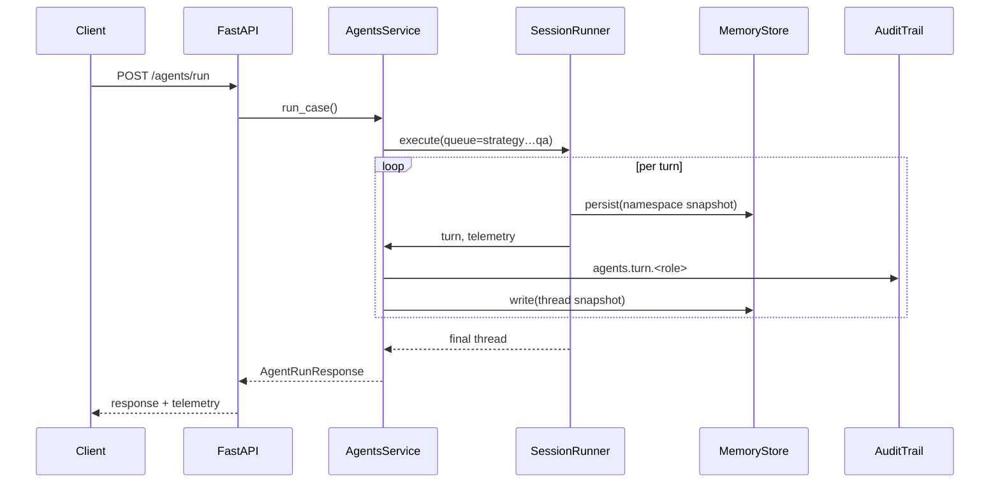

# Microsoft Agents SDK Session Orchestrator — Flow Update

This addendum captures the refreshed backend orchestration now powered by the Microsoft Agents SDK session graph. The diagrams below map the TRD personas to SDK agents, highlight delegated tool calls, and show how shared memory snapshots persist after every turn.

## Session Graph

```mermaid
graph TD
    U[User Brief] --> S(Strategy Planner)
    S --> I(Ingestion Steward)
    I --> R(Research Analyst)
    R --> C(CoCounsel Aggregator)
    C --> Q(QA Adjudicator)
    subgraph Shared Memory (AgentMemoryStore)
        M1[plan]
        M2[insights]
        M3[artifacts]
        M4[qa]
        M5[conversation]
    end
    S -.update plan.-> M1
    I -.update ingestion insights.-> M2
    R -.write retrieval results.-> M2
    C -.attach forensics bundle.-> M3
    Q -.persist rubric scores.-> M4
    Q -.append notes.-> M5
```

## Turn Execution & Telemetry



## Memory Layout

```json
{
  "plan": {"steps": ["Validate ingestion", "Synthesize research", "QA rubric"]},
  "insights": {
    "ingestion": {"document_total": 12, "status": "ready"},
    "retrieval": {"answer": "…", "citations": ["doc-001"]}
  },
  "artifacts": {"documents": ["doc-001"]},
  "qa": {"average": 8.9, "scores": {"Technical Accuracy": 9.1}},
  "conversation": [
    {"role": "user", "content": "Summarise the timeline"},
    {"role": "agent", "name": "Strategy", "metadata": {"delegated_to": ["ingestion"]}}
  ],
  "turns": [
    {"role": "strategy", "action": "draft_plan", "metrics": {"step_count": 4}},
    {"role": "ingestion", "action": "audit_workspace", "metrics": {"documents": 12}}
  ]
}
```

The orchestrator now stores every namespace via the SDK memory adapters backed by `AgentMemoryStore`, enabling recovery mid-run and complete telemetry playback across the TRD workflow.
