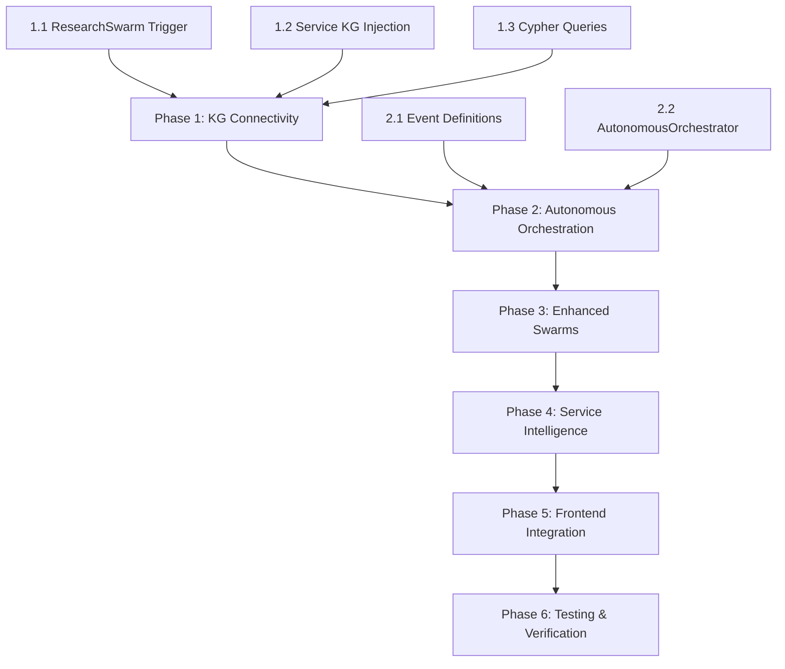

# Co-Counsel Master Task List v2.0 - Path to Perfection

> **Generated**: 2025-12-18
> **Previous Version**: [TODO.md](file:///I:/projects/op_veritas_2/PRPs/TODO.md)
> **Audit Document**: [implementation_plan.md](file:///C:/Users/manny/.gemini/antigravity/brain/80294e0a-72d1-4415-81c5-03ac3cf00bbd/implementation_plan.md)

---

## Executive Summary

This master task list supersedes the Phase 1 TODO.md and addresses the critical gaps identified in the comprehensive system audit. The goal is **world-class autonomous legal intelligence** - where uploading evidence files triggers an autonomous pipeline that populates the knowledge graph, researches relevant law, builds timelines, identifies contradictions, and delivers actionable court-ready intelligence.

---

## 🔴 CRITICAL PRIORITY: Knowledge Graph Integration

### 1.1 Automatic ResearchSwarm Trigger After Ingestion

**Why**: Currently, documents are ingested and stored in the KG (in pro mode), but no autonomous research happens. The ResearchSwarm exists but must be manually invoked.

| Task | File | Complexity |
|------|------|------------|
| Add ResearchSwarm trigger in `process_job()` | `backend/app/services/ingestion.py` | Medium |
| Schedule as background task after graph indexing | `backend/app/services/ingestion.py` | Low |
| Add telemetry for autonomous research | `backend/app/services/ingestion.py` | Low |

### 1.2 Service-to-KG Dependency Injection

**Why**: Most services operate in isolation without querying the knowledge graph for context.

| Service | Gap | Required Change |
|---------|-----|-----------------|
| `NarrativeService` | Doesn't query KG for events | Add `kg_service` injection |
| `DevilsAdvocateService` | Doesn't query KG for evidence | Add `kg_service` injection |
| `TimelineService` | Doesn't query KG for temporal data | Add `kg_service` injection |
| `JurySentimentService` | Doesn't query KG for parties | Add `kg_service` injection |
| `ForensicsService` | Doesn't query KG for doc metadata | Add `kg_service` injection |
| `SimulationService` | Doesn't query KG for case context | Add `kg_service` injection |
| `ScenarioService` | Doesn't query KG for facts | Add `kg_service` injection |

### 1.3 Cypher Query Implementation per Service

**Why**: Even with KG access, services need specific Cypher queries for their domain.

| Service | Query Needed |
|---------|--------------|
| `NarrativeService` | `MATCH (c:Case)-[:HAS_EVENT]->(e:Event) RETURN e ORDER BY e.date` |
| `DevilsAdvocateService` | `MATCH (c:CauseOfAction)<-[:SUPPORTS]-(e:Evidence) RETURN e` |
| `TimelineService` | `MATCH (d:Document)-[:MENTIONS]->(date:Date) RETURN d, date` |
| `JurySentimentService` | `MATCH (c:Case)-[:INVOLVES]->(p:Party) RETURN p` |

---

## 🔴 CRITICAL PRIORITY: Autonomous Orchestration

### 2.1 Event-Driven Architecture

**Why**: The system has an EventBus but it's underutilized. Autonomous intelligence requires event-driven coordination.

| Task | Details |
|------|---------|
| **Define Events** | `DocumentIngestedEvent`, `ResearchCompletedEvent`, `GraphUpdatedEvent`, `ContradictionDetectedEvent`, `StrategyReadyEvent` |
| **Create AutonomousOrchestrator** | Central service that subscribes to events and triggers appropriate actions |
| **Wire to FastAPI Startup** | Initialize orchestrator on application start |

### 2.2 Orchestrator Event Handlers

```python
# Pseudocode for autonomous_orchestrator.py
class AutonomousOrchestrator:
    async def on_document_ingested(self, event: DocumentIngestedEvent):
        # 1. Trigger Research Swarm for new document
        await research_swarm.research_for_document(event.doc_id, ...)
        
        # 2. If flagged as opposition, schedule forensic screening
        if "opposition" in event.flags:
            await forensic_service.deep_analyze(event.doc_id)
    
    async def on_research_completed(self, event: ResearchCompletedEvent):
        # 1. Upsert findings to KG (already happens in swarm)
        # 2. Trigger narrative timeline rebuild
        await narrative_service.rebuild_timeline(event.case_id)
        
        # 3. Run Devil's Advocate for contradictions
        await devils_advocate.analyze(event.case_id)
    
    async def on_graph_updated(self, event: GraphUpdatedEvent):
        # 1. Regenerate strategy brief
        await graph_service.generate_strategy_brief(event.case_id)
```

---

## 🟡 HIGH PRIORITY: Enhanced Swarms

### 3.1 IngestionSwarm Expansion

**Why**: Currently has only 1 agent. Should have parallel processing with specialized agents.

| New Agent | Responsibility | Tools |
|-----------|---------------|-------|
| `RouterAgent` | Document type classification/routing | Classification LLM |
| `PrivilegeDetectorAgent` | Attorney-client privilege screening | Privilege analysis LLM |
| `HotDocumentAgent` | Key evidence flagging | Evidence scoring LLM |
| `MetadataEnricherAgent` | Legal metadata extraction | Regex + LLM |
| `GraphLinkerAgent` | Create entities/relationships in KG | KnowledgeGraphService |
| `QAValidatorAgent` | Final quality assurance | QAAgent |

### 3.2 ResearchSwarm Enhancement

**Current**: 3 agents (CourtListener, CA Codes, Federal Codes) - ✅ Good

**Enhancements Needed**:
| Task | Details |
|------|---------|
| Automatic KG upsert verification | Ensure all findings are upserted |
| Cross-citation analysis | Identify overlapping precedents |
| Jurisdiction-aware routing | Route to appropriate code agent based on case |
| Depth-first research | Follow citations recursively |

---

## 🟡 HIGH PRIORITY: Service Intelligence Upgrades

### 4.1 NarrativeService

| Current | Target |
|---------|--------|
| Generates timeline from document text | Query KG for all case events |
| Basic contradiction detection | Use graph patterns for contradictions |
| Single document focus | Cross-document narrative synthesis |

### 4.2 DevilsAdvocateService

| Current | Target |
|---------|--------|
| Analyzes provided text | Query KG for all evidence supporting each cause |
| Generic adversarial prompts | Graph-informed counterarguments |
| No evidence scoring | Score weaknesses by graph connectivity |

### 4.3 MockTrialArenaService

| Current | Target |
|---------|--------|
| Simulates arguments | Query KG for witness/evidence nodes |
| Static cross-examination | Graph-based cross-examination generation |
| Manual evidence selection | Auto-select strongest evidence from graph |

---

## 🟢 MEDIUM PRIORITY: Frontend KG Visualization

### 5.1 Module Enhancements

| Module | Enhancement |
|--------|-------------|
| `NarrativeModule` | Show KG-derived timeline with document links |
| `DevilsAdvocateModule` | Visualize evidence support graph |
| `TimelineModule` | Interactive graph-based timeline |
| `EvidenceMapModule` | Full force-directed graph of case evidence |
| `LegalTheoryModule` | Show cause-of-action support scores from KG |

### 5.2 New Visualizations

| Feature | Description |
|---------|-------------|
| Case Context Dashboard | Summary of KG nodes/edges per case |
| Evidence Strength Heatmap | Visual of which causes have strongest support |
| Contradiction Alert Panel | Auto-highlighted contradictions from KG |

---

## 🟢 MEDIUM PRIORITY: Testing & Verification

### 6.1 Integration Tests

| Test | What It Verifies |
|------|------------------|
| `test_ingestion_to_kg.py` | Documents flow to Neo4j |
| `test_research_swarm_trigger.py` | Swarm auto-triggered after ingestion |
| `test_cross_module_kg_queries.py` | Services correctly query KG |
| `test_autonomous_orchestrator.py` | Events trigger correct handlers |

### 6.2 End-to-End Verification

1. Upload a case folder with multiple documents
2. Verify in Neo4j Browser: nodes/relationships created
3. Verify ResearchSwarm was triggered (check logs)
4. Verify each module displays KG-derived insights
5. Verify contradictions are detected and flagged

---

## Implementation Order



---

## Success Criteria

✅ **Level 1**: Upload documents → They appear in Neo4j graph
✅ **Level 2**: Upload documents → ResearchSwarm automatically researches
✅ **Level 3**: Research completes → Timeline automatically rebuilt
✅ **Level 4**: Timeline rebuilt → Devil's Advocate automatically analyzes
✅ **Level 5**: All modules display KG-derived insights
✅ **Level 6**: Contradictions auto-detected and flagged
✅ **Level 7**: Full strategy brief generated from KG on demand

---

## Notes for Implementation

> [!IMPORTANT]
> **Cost Mode**: Most KG features require "pro" mode. Ensure `INGESTION_COST_MODE=pro` in `.env`.

> [!WARNING]
> **Neo4j Connectivity**: Verify Neo4j is running and `NEO4J_URI`, `NEO4J_USER`, `NEO4J_PASSWORD` are correctly set.

> [!TIP]
> **Incremental Testing**: After each phase, run the corresponding verification script before proceeding.
