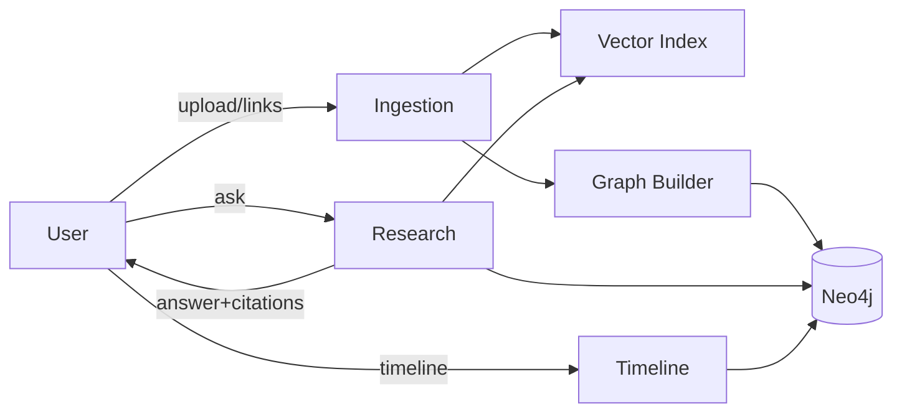

name: "Planning — Co-Counsel (MS Agents + LlamaIndex + Swarms)"
description: |
  Generate a concrete PRD/plan for the legal co-counsel MVP using local-first vector+graph RAG, Microsoft Agents Framework workflows, and Swarms role schemas.

> **PRP Navigation:** [Base](PRP_CoCounsel_MSAgents_LlamaIndex_Swarms_base.md) · [Planning](PRP_CoCounsel_MSAgents_LlamaIndex_Swarms_planning.md) · [Spec](PRP_CoCounsel_MSAgents_LlamaIndex_Swarms_spec.md) · [Tasks](PRP_CoCounsel_MSAgents_LlamaIndex_Swarms_tasks.md) · [Pre-PRP Plan](PRE_PRP_PLAN.md) · [ACE Execution Guide](EXECUTION_GUIDE_ACE.md) · [Task List Master](TASK_LIST_MASTER.md) · [PRP Templates](templates/README.md)

## Initial Concept
Build an enterprise-ready legal discovery assistant (MVP) that ingests a small corpus, builds vector + graph indexes, answers questions with citations, and renders a basic timeline.

## Research Focus (internal-only)
- libraries: Microsoft Agents Framework SDK; LlamaIndex core; Neo4j driver; Qdrant/Chroma; image/PDF/email forensics libs (EXIF, PDF parsers, ELA/PRNU methods)
- patterns: GraphRAG; hybrid retrieval; role-based swarms; observability (OTel); authenticity verification pipelines
- constraints: local-first viable; minimal external dependencies; Docker-based; provider abstraction for LLMs (Gemini default, GPT optional)

## Executive Summary
Problem: Legal teams need explainable, auditable answers grounded in their evidence.
Solution: Multi-agent GraphRAG using MS Agents + LlamaIndex, with citations and graph paths exposed in UI.
Success Metrics: (a) >=90% answers include at least 2 citations; (b) timeline events link to sources; (c) reproducible ingest runs with telemetry.

## User Flow (primary)


## High-Level Architecture
```mermaid
graph TB
  subgraph Frontend
    UI(Chat/Timeline)
  end
  subgraph Backend(API)
    A[Agents Workflow]
    S[Stores: Vector, Graph]
  end
  UI --> A
  A --> S
```

## Technical Specs (MVP)
- API
  - POST /ingest {sources: [...]}
  - GET /query?q=...
  - GET /timeline
  - GET /graph/neighbor?id=...
  - GET /forensics/document?id=...
  - GET /forensics/image?id=...
  - GET /forensics/financial?id=...
- Data
  - Vector: Qdrant/Chroma directory
  - Graph: Neo4j 5.x; constraints on ids
  - Forensics: artifact outputs per file (hash.json, metadata.json, structure.json, authenticity.json, financial.json)

## Implementation Phases
1. Foundation: settings, stores, basic API, compose
2. Ingestion: folder upload, OCR + Vision‑LLM agent, chunk/embeddings, persist
3. GraphRAG: triples extraction, Cypher upserts, ontology
4. Forensics Core: hashing/metadata/structure/image authenticity; financial baseline
5. Retrieval: hybrid retriever, citations, traces
6. UI: chat stream, citations, timeline, forensics views
7. QA: gates, scripts, metrics

## Validation & Challenges
- Devise adversarial questions; require cite-or-silence
- Track retrieval contexts in traces; assert non-empty citations
