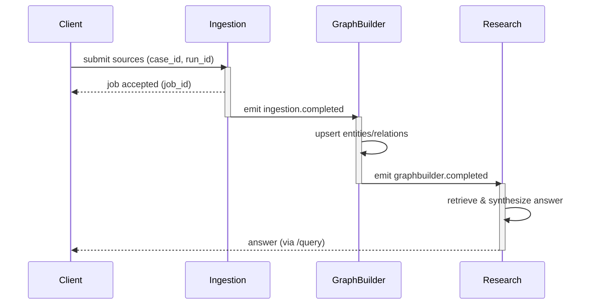
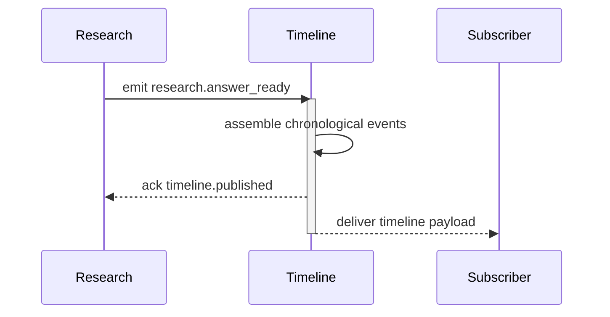
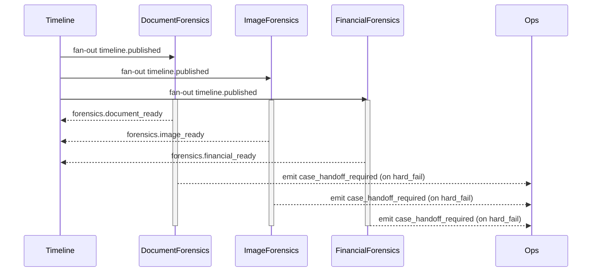

name: "Spec — Co-Counsel (MVP)"
version: 0.2

> **PRP Navigation:** [Base](PRP_CoCounsel_MSAgents_LlamaIndex_Swarms_base.md) · [Planning](PRP_CoCounsel_MSAgents_LlamaIndex_Swarms_planning.md) · [Spec](PRP_CoCounsel_MSAgents_LlamaIndex_Swarms_spec.md) · [Tasks](PRP_CoCounsel_MSAgents_LlamaIndex_Swarms_tasks.md) · [Pre-PRP Plan](PRE_PRP_PLAN.md) · [ACE Execution Guide](EXECUTION_GUIDE_ACE.md) · [Task List Master](TASK_LIST_MASTER.md) · [PRP Templates](templates/README.md)

## APIs

### Access Control Overview
- **Authentication Stack**: All Co-Counsel HTTP surfaces require mutual TLS (client certificates issued by the LegalOps private
  PKI) plus OAuth 2.0 client-credential grants minted by the Platform Identity Service. Tokens carry a `aud` claim of
  `co-counsel.api` and expire after 10 minutes; refresh is achieved through signed workload identities. Certificate rotation is
  automated every 90 days with 24-hour overlap windows.
- **Authorization Engine**: Policy decisions are enforced through Oso embedded in the API gateway with role metadata derived
  from the token `roles` claim. Runtime enforcement supports deny-overrides with explicit approval journaling.
- **Canonical Roles**:
  - `CaseCoordinator` — Orchestrates case intake, ingestion schedules, and downstream publishing.
  - `ResearchAnalyst` — Performs interactive querying and narrative construction; read-only against ingestion state.
  - `ForensicsOperator` — Manages forensic workloads and reviews signal outputs; read/write on forensic reruns.
  - `ComplianceAuditor` — Read-only visibility into every artifact plus privileged access to audit trails.
  - `PlatformEngineer` — Maintains infrastructure, handles emergency retries/cancellations, and can assume other roles through
    break-glass approvals.
  - `AutomationService` — System-to-system integrations (scheduled refresh, CI) with tightly scoped service principals.
- **Emergency Elevation**: Break-glass access escalates to `PlatformEngineer` with one-time approval codes; actions must be
  reconciled within 24 hours in the audit ledger.

### POST /ingest
**Summary**: Queue document sources for processing. Implemented via `backend.app.models.api.IngestionRequest` ➜ `IngestionResponse`.

| Aspect | Value |
| --- | --- |
| Method | POST |
| Path | `/ingest` |
| Authentication | Mutual TLS + OAuth2 client credentials (`aud=co-counsel.ingest`, 10 min TTL) |
| Authorization | RBAC via Oso — `CaseCoordinator`, `PlatformEngineer`, `AutomationService` may enqueue; `ComplianceAuditor` read-only |
| Synchronous Response | `202 Accepted` with `IngestionResponse` payload |
| Long-running Behaviour | Jobs processed asynchronously; clients poll `/ingest/{job_id}` |

#### Request Schema — `IngestionRequest`
| Field | Type | Required | Validation Rules | Notes |
| --- | --- | --- | --- | --- |
| `sources` | array of [`IngestionSource`](#ingestionsource) | yes | `minItems=1` | Source definitions processed sequentially |

##### `IngestionSource`
| Field | Type | Required | Validation Rules | Notes |
| --- | --- | --- | --- | --- |
| `type` | string | yes | Enum: `local`, `sharepoint`, `s3`, `onedrive`, `web` | Drives downstream connector selection |
| `path` | string | conditional | Required for `local`, `onedrive`, and `web` sources. For `local` it must resolve under configured mount; for `onedrive` supply folder relative to drive root; for `web` provide HTTP(S) URL | Absolute path, relative drive path, or URL |
| `credRef` | string | conditional | Required for `sharepoint`, `s3`, and `onedrive`; must match credentials registry key | Secrets fetched server-side |

**Connector behaviour**
- `local` — Reads files from on-disk workspace. Validation ensures directory existence.
- `s3` — Requires optional dependency `boto3`; downloads bucket objects into a per-job workspace. Credential payload must include `bucket` and key material.
- `sharepoint` — Uses `Office365-REST-Python-Client` to traverse folders with client credentials.
- `onedrive` — Uses Microsoft Graph via `msal` + `httpx`. Credential payload must include `tenant_id`, `client_id`, `client_secret`, and `drive_id`. The optional dependency `msal` must be installed.
- `web` — Fetches a single HTTP(S) URL via `httpx` and stores the response body. Non-2xx responses fail the job with `502`.

```json
{
  "sources": [
    {"type": "local", "path": "./data/case-512"},
    {"type": "sharepoint", "credRef": "sharepoint/corp-legal"}
  ]
}
```

#### Response Schema — `IngestionResponse`
| Field | Type | Validation Rules | Notes |
| --- | --- | --- | --- |
| `job_id` | string | RFC 4122 UUID | Stable identifier for lifecycle polling |
| `status` | string | Enum: `queued`, `running`, `succeeded`, `failed` | Reflects current job state at time of response |

```json
{
  "job_id": "0f6f7bc4-322b-4e61-a4f7-4b9a61d1adbe",
  "status": "queued"
}
```

#### Authentication & Authorization
- **Token Scopes**: `ingest:enqueue`, `ingest:status`. Tokens without both scopes receive `403` even with valid TLS.
- **Mutual TLS Mapping**: Client certificate Common Name must match registered service principal; rotation logged via
  `identity.certificate_rotated` audit event.
- **Role Matrix**:

  | Role | POST `/ingest` | Notes |
  | --- | --- | --- |
  | `CaseCoordinator` | ✅ | Default for orchestration service; may attach `case_id` constraints. |
  | `PlatformEngineer` | ✅ (with break-glass flag) | Requires incident ticket reference in request metadata. |
  | `AutomationService` | ✅ | Limited to scheduled backfill contexts defined by `run_profile`. |
  | `ResearchAnalyst` | ❌ | Denied; analytics flows must request ingestion through coordinator. |
  | `ForensicsOperator` | ❌ | Denied to prevent privilege creep. |
  | `ComplianceAuditor` | 🔍 Read metadata via `/ingest/{job_id}` only | Cannot enqueue new work. |

#### Error Envelope — `HTTPValidationError`
| Code | Body |
| --- | --- |
| 400 | `{"detail": "At least one source must be provided"}` |
| 404 | `{"detail": "Source path ./data/case-512 not found"}` |
| 422 | `{"detail": "Unsupported ingestion source type"}` |

### GET /ingest/{job_id}
**Summary**: Poll ingestion status for asynchronous lifecycle. Implemented via `backend.app.models.api.IngestionStatusResponse`.

| Aspect | Value |
| --- | --- |
| Method | GET |
| Path | `/ingest/{job_id}` |
| Authentication | Mutual TLS + OAuth2 client credentials (`aud=co-counsel.ingest`) |
| Authorization | RBAC via Oso — `CaseCoordinator`, `PlatformEngineer`, `ComplianceAuditor`, `ForensicsOperator` |
| Path Parameters | `job_id` (UUID) |
| Success Codes | `200 OK` when terminal state reached, `202 Accepted` when still processing |
| Error Codes | `404 Not Found` if job unknown, `410 Gone` if history expired |

#### Response Schema — `IngestionStatusResponse`
| Field | Type | Validation Rules | Notes |
| --- | --- | --- | --- |
| `job_id` | string | RFC 4122 UUID | Echoes request identifier |
| `status` | string | Enum: `queued`, `running`, `succeeded`, `failed`, `cancelled` | `succeeded` indicates downstream graph, timeline, and forensics pipelines triggered |
| `submitted_at` | string (ISO 8601 UTC) | `format=date-time` | Original enqueue timestamp |
| `updated_at` | string (ISO 8601 UTC) | `format=date-time` | Last state change |
| `errors` | array of objects | Each entry `{ "code": string, "message": string, "source": string }`; optional | Populated when `status` is `failed` |

```json
{
  "job_id": "0f6f7bc4-322b-4e61-a4f7-4b9a61d1adbe",
  "status": "running",
  "submitted_at": "2025-10-27T07:59:41Z",
  "updated_at": "2025-10-27T08:04:12Z",
  "errors": []
}
```

#### Authentication & Authorization
- **Token Scopes**: Require `ingest:status`. Requests missing `case_id` claim aligned with job metadata are rejected with
  `403` and audit event `ingest.scope_mismatch`.
- **Role Matrix**:

  | Role | GET `/ingest/{job_id}` | Notes |
  | --- | --- | --- |
  | `CaseCoordinator` | ✅ | Full visibility; may cancel via separate control plane. |
  | `PlatformEngineer` | ✅ | Access restricted to active incident window; trace ID required. |
  | `ComplianceAuditor` | ✅ (read-only) | Response augmented with audit annotations. |
  | `ForensicsOperator` | ✅ (read-only) | Only for artifacts assigned to operator's tenant; enforced via ABAC attribute `tenant_id`. |
  | `ResearchAnalyst` | 🔍 Limited | May access once ingestion status transitions to `succeeded`; otherwise `403` with `ingest.analyst_blocked`. |
  | `AutomationService` | ✅ | Observability bots poll for job completion; rate limit 6 RPM per job. |

#### Lifecycle Semantics
| Stage | Description |
| --- | --- |
| Initial Response | `202 Accepted` with `status="queued"`; manifests persisted immediately for `/ingest/{job_id}`. |
| Polling Loop | Service returns `202 Accepted` while `status` is `queued` or `running`; transitions to `200 OK` once job enters a terminal state (`succeeded`, `failed`, or `cancelled`). |
| Caching | Clients MAY send `If-None-Match`; service SHOULD return `304 Not Modified` when status unchanged. |

### GET /query
**Summary**: Retrieve synthesized answer with citations. Implemented via `backend.app.models.api.QueryResponse`. Pagination metadata will be attached using forthcoming `QueryPagination` Pydantic model.

| Aspect | Value |
| --- | --- |
| Method | GET |
| Path | `/query` |
| Authentication | Mutual TLS + OAuth2 client credentials (`aud=co-counsel.query`) |
| Authorization | RBAC via Oso — `ResearchAnalyst`, `CaseCoordinator`, `ComplianceAuditor` |
| Required Query Parameters | `q` (string, minLength=3) |
| Optional Query Parameters | `page` (integer ≥ 1, default 1), `page_size` (integer 1–50, default 10), `filters[source]` (string enum matching ingestion source types), `filters[entity]` (string), `rerank` (boolean) |
| Success Codes | `200 OK` |
| Error Codes | `204 No Content` when no supporting evidence, `500 Internal Server Error` when retrieval pipeline fails |

#### Response Schema — `QueryResponse`
| Field | Type | Validation Rules | Notes |
| --- | --- | --- | --- |
| `answer` | string | Non-empty | Primary synthesized response |
| `citations` | array of `CitationModel` | `minItems=0` | Aligns with `backend.app.models.api.CitationModel` |
| `traces` | `TraceModel` | Contains vector and graph diagnostics | Aligns with `backend.app.models.api.TraceModel` |

##### Pagination Metadata (planned `QueryPagination`)
| Field | Type | Validation | Notes |
| --- | --- | --- | --- |
| `page` | integer | ≥ 1 | Current page |
| `page_size` | integer | 1–50 | Items per page |
| `total_items` | integer | ≥ 0 | Count of trace vector hits |
| `has_next` | boolean | | Indicates if `Link` header for next page present |

```json
{
  "answer": "Acme entered into the supply agreement on 2024-05-12 and breached the exclusivity clause in Q3.",
  "citations": [
    {"docId": "doc-492", "span": "Paragraph 4", "uri": "https://dms.example.com/doc-492"}
  ],
  "traces": {
    "vector": [
      {"id": "vec-01", "score": 0.87, "docId": "doc-492"},
      {"id": "vec-02", "score": 0.81, "docId": "doc-771"}
    ],
    "graph": {
      "nodes": [
        {"id": "entity::Acme", "type": "Entity", "properties": {"label": "Acme Corp"}}
      ],
      "edges": [
        {"source": "doc-492", "target": "entity::Acme", "type": "MENTIONS", "properties": {"evidence": "Acme"}}
      ]
    }
  },
  "meta": {
    "page": 1,
    "page_size": 10,
    "total_items": 24,
    "has_next": true
  }
}
```

#### Authentication & Authorization
- **Token Scopes**: `query:read` mandatory; optional `query:trace` adds diagnostics fields. Tokens are rate-limited to 60 RPM per
  principal with adaptive throttling when guardrail policies trigger.
- **Role Matrix**:

  | Role | GET `/query` | Diagnostics Access | Notes |
  | --- | --- | --- | --- |
  | `ResearchAnalyst` | ✅ | ✅ (requires `query:trace`) | Primary consumer; may request rerank with `rerank=true`. |
  | `CaseCoordinator` | ✅ | 🔍 Summary only | Detailed traces hidden unless `query:trace` scope added for postmortems. |
  | `ComplianceAuditor` | ✅ | ✅ | Audit token includes immutable correlation ID `audit_session_id`. |
  | `PlatformEngineer` | ✅ (break-glass) | ✅ | Must cite incident ID; requests mirrored to audit sink. |
  | `ForensicsOperator` | 🔍 Limited | Access gated to queries referencing forensic artifacts; ABAC ensures `artifact_scope` claim match. |
  | `AutomationService` | ❌ | ❌ | Automated querying prohibited to prevent data mining. |

### GET /timeline
**Summary**: Return chronological events. Implemented via `backend.app.models.api.TimelineResponse` and `TimelineEventModel`. Pagination extension will reuse planned `TimelinePagination` model.

| Aspect | Value |
| --- | --- |
| Method | GET |
| Path | `/timeline` |
| Authentication | Mutual TLS + OAuth2 client credentials (`aud=co-counsel.timeline`) |
| Authorization | RBAC via Oso — `ResearchAnalyst`, `CaseCoordinator`, `ComplianceAuditor` |
| Optional Query Parameters | `cursor` (opaque string), `limit` (integer 1–100, default 20), `from_ts` & `to_ts` (ISO 8601 timestamps), `entity` (string) |
| Success Codes | `200 OK` |
| Empty Result Handling | Returns `events: []` with corresponding pagination metadata |

#### Response Schema — `TimelineResponse`
| Field | Type | Validation Rules | Notes |
| --- | --- | --- | --- |
| `events` | array of `TimelineEventModel` | Items sorted ascending by `ts` | Mirrors `backend.app.models.api.TimelineResponse` |

##### `TimelineEventModel`
| Field | Type | Validation Rules | Notes |
| --- | --- | --- | --- |
| `id` | string | Unique per event | Stable identifier (document::event::<n>) |
| `ts` | string (ISO 8601 UTC) | `format=date-time` | Ingestion time or document timestamp |
| `title` | string | Non-empty | Short label |
| `summary` | string | Non-empty | Narrative summary |
| `citations` | array of string | Contains document identifiers | Links back to sources |

##### Pagination Metadata (planned `TimelinePagination`)
| Field | Type | Validation | Notes |
| --- | --- | --- | --- |
| `cursor` | string | Optional; opaque | Use for next page requests |
| `limit` | integer | 1–100 | Reflects request limit |
| `has_more` | boolean | | Indicates additional events exist |

```json
{
  "events": [
    {
      "id": "doc::event::0",
      "ts": "2024-10-26T00:00:00Z",
      "title": "Initial Contract Execution",
      "summary": "Acme and Contoso executed the master supply agreement.",
      "citations": ["doc-492"]
    }
  ],
  "meta": {
    "cursor": "g2wAAAAB",
    "limit": 20,
    "has_more": false
  }
}
```

#### Authentication & Authorization
- **Token Scopes**: `timeline:read` is required, with optional `timeline:forensics` enabling inline forensic signal previews.
- **Row-Level Filtering**: Attribute-based rules align `case_id`, `entity_scope`, and `tenant_id` claims to event metadata before
  release; mismatches yield `404` to avoid information disclosure.
- **Role Matrix**:

  | Role | GET `/timeline` | Extended Metadata | Notes |
  | --- | --- | --- | --- |
  | `ResearchAnalyst` | ✅ | ✅ | Receives event provenance and pagination hints. |
  | `CaseCoordinator` | ✅ | 🔍 Summary | Extended metadata hidden unless `case_admin=true`. |
  | `ComplianceAuditor` | ✅ | ✅ | Gains immutable audit references and hash chains. |
  | `PlatformEngineer` | ✅ (break-glass) | ✅ | Access logged with `access.reason` justification. |
  | `ForensicsOperator` | 🔍 Limited | May request events tied to assigned artifacts only. |
  | `AutomationService` | ✅ | ❌ | Allowed for scheduled dossier exports; metadata trimmed to case_id only. |

### GET /graph/neighbor
**Summary**: Retrieve neighboring nodes around an entity. Implemented via `backend.app.models.api.GraphNeighborResponse`.

| Aspect | Value |
| --- | --- |
| Method | GET |
| Path | `/graph/neighbor` |
| Authentication | Mutual TLS + OAuth2 client credentials (`aud=co-counsel.graph`) |
| Authorization | RBAC via Oso — `ResearchAnalyst`, `CaseCoordinator`, `ComplianceAuditor`, `PlatformEngineer` |
| Required Query Parameters | `id` (string) |
| Success Codes | `200 OK` |
| Error Codes | `404 Not Found` when node absent |

#### Response Schema — `GraphNeighborResponse`
| Field | Type | Validation Rules | Notes |
| --- | --- | --- | --- |
| `nodes` | array of `GraphNodeModel` | Non-empty | Each node includes `id`, `type`, `properties` |
| `edges` | array of `GraphEdgeModel` | Non-empty | Each edge includes `source`, `target`, `type`, `properties` |

```json
{
  "nodes": [
    {"id": "entity::Acme", "type": "Entity", "properties": {"label": "Acme"}}
  ],
  "edges": [
    {
      "source": "doc-492",
      "target": "entity::Acme",
      "type": "MENTIONS",
      "properties": {"evidence": "Acme"}
    }
  ]
}
```

#### Authentication & Authorization
- **Token Scopes**: `graph:read` with optional `graph:debug` enabling schema metadata. Denied scopes return `403` with
  `graph.scope_violation` audit log.
- **Graph Visibility Filters**: Entities tagged `privileged=true` require `case_privilege_override` attribute from the compliance
  approval workflow.
- **Role Matrix**:

  | Role | GET `/graph/neighbor` | Schema Metadata | Notes |
  | --- | --- | --- | --- |
  | `ResearchAnalyst` | ✅ | 🔍 Attribute filtered | Receives sanitized node properties (PII redacted). |
  | `CaseCoordinator` | ✅ | ✅ | Allowed to view relationship provenance when `case_admin=true`. |
  | `ComplianceAuditor` | ✅ | ✅ | Full schema visibility with audit watermarking. |
  | `PlatformEngineer` | ✅ (break-glass) | ✅ | Access mirrored to on-call channel. |
  | `ForensicsOperator` | 🔍 Limited | Only permitted when graph node references forensic artifact. |
  | `AutomationService` | ❌ | ❌ | Graph introspection blocked for bots. |

### GET /forensics/document | /forensics/image | /forensics/financial
**Summary**: Fetch artifact-specific forensic analysis. Implemented via `backend.app.models.api.ForensicsResponse`.

| Aspect | Value |
| --- | --- |
| Methods | GET |
| Paths | `/forensics/document`, `/forensics/image`, `/forensics/financial` |
| Authentication | Mutual TLS + OAuth2 client credentials (`aud=co-counsel.forensics`) |
| Authorization | RBAC via Oso — `ForensicsOperator`, `ComplianceAuditor`, `CaseCoordinator` (read-only) |
| Required Query Parameters | `id` (string) |
| Success Codes | `200 OK` |
| Error Codes | `404 Not Found` when artifact missing, `415 Unsupported Media Type` when no fallback available |

#### Response Schema — `ForensicsResponse`
| Field | Type | Validation Rules | Notes |
| --- | --- | --- | --- |
| `artifact_id` | string | Matches ingestion asset identifier | Primary lookup key |
| `artifact_type` | string | Enum: `document`, `image`, `financial` | Mirrors endpoint |
| `pipeline_version` | string | SemVer | Communicates toolbox release |
| `summary` | object | Required keys: `risk_level`, `headline`, `confidence` | One-line executive readout |
| `hashes` | object | Contains `sha256` + optional `md5`, `tlsh` | Always populated |
| `metadata` | object | Non-empty | Canonicalized metadata map |
| `signals` | array | Each entry `{ "category": string, "name": string, "value": any, "evidence": string }` | Detailed detections |
| `fallback_applied` | boolean | | `true` when toolbox used downgrade path |
| `raw` | object | Optional | Type-specific payload (`structure`, `authenticity`, `anomalies`, etc.) |

```json
{
  "artifact_id": "doc-492",
  "artifact_type": "document",
  "pipeline_version": "1.2.0",
  "summary": {"risk_level": "medium", "headline": "PDF metadata edited post-signature", "confidence": 0.71},
  "hashes": {"sha256": "e3b0c44298fc1c149afbf4c8996fb92427ae41e4649b934ca495991b7852b855", "tlsh": "T10293BD123AB4F1E3"},
  "metadata": {"mime": "application/pdf", "pages": 12, "producer": "Acrobat Pro 2024"},
  "signals": [
    {"category": "authenticity", "name": "xmp_modification_after_signature", "value": true, "evidence": "xmp:ModifyDate 2024-10-19"}
  ],
  "fallback_applied": false,
  "raw": {
    "structure": {"toc": ["Summary", "Findings"]},
    "authenticity": {"ela": {"score": 0.96}, "clone": {"matches": []}}
  }
}
```

#### Authentication & Authorization
- **Token Scopes**: `forensics:read` plus type-specific scope (`forensics:document`, `forensics:image`, or `forensics:financial`).
  Scope mismatches return `403` with `forensics.scope_violation` payload.
- **Attribute Binding**: Responses enforce match on `artifact_scope`, `case_id`, and `tenant_id` attributes. Artifacts flagged
  `privileged=true` additionally require `case_privilege_override` approval referencing ticket ID.
- **Role Matrix**:

  | Role | GET `/forensics/*` | Writeback / Rerun Triggers | Notes |
  | --- | --- | --- | --- |
  | `ForensicsOperator` | ✅ | ✅ (via control plane) | Full payload plus raw analyzer output. |
  | `ComplianceAuditor` | ✅ | ❌ | Receives immutable hash chains and provenance metadata. |
  | `CaseCoordinator` | ✅ (summary only) | ❌ | Raw signal arrays redacted; only `summary`, `hashes`, `status`. |
  | `PlatformEngineer` | ✅ (break-glass) | ✅ | Requires incident reference; responses mirrored to audit queue. |
  | `ResearchAnalyst` | 🔍 Limited | ❌ | Must include `reason=case_analysis` and `citation_id` referencing query evidence. |
  | `AutomationService` | ❌ | ❌ | Forensic payload automation forbidden. |

### Forensics Toolbox Execution Blueprint
1. **Canonicalization Pass** — normalize path/URI, stream bytes, and compute hashes (`sha256`, optional `md5`, `tlsh`) using `hashlib`/`tlsh`.
2. **Metadata Probing** — determine MIME via `python-magic`, harvest core metadata with `hachoir`, and capture file size + timestamps.
3. **Type Routing** — select analyzer based on MIME/extension: `DocumentAnalyzer`, `ImageAnalyzer`, or `FinancialAnalyzer` (see below). Unknown types branch to the fallback routine.
4. **Analyzer Execution Order**:
   - `DocumentAnalyzer`:
     1. Parse containers via `pypdf` (PDF), `python-docx` (DOCX), `extract-msg` (MSG/EML); fallback to `pdfminer.six`/`textract` for text-only extraction.
     2. Run structure modeling (TOC, outlines) and semantic segmentation with `unstructured`.
     3. Perform authenticity checks: signature inspection (`pikepdf`), revision diffing, header consistency (`mailparser` for emails).
   - `ImageAnalyzer`:
     1. Extract EXIF via `piexif` and `Pillow`.
     2. Execute Error Level Analysis with `opencv-python` + `numpy`.
     3. Perform clone/PRNU heuristics using `imagededup` (SSIM) and `pyprnu`; degrade to EXIF-only when dimensions < 128px or unsupported color model.
   - `FinancialAnalyzer`:
     1. Load ledger/tabular sources into `pandas` with `pyarrow` acceleration.
     2. Validate accounting identities using `decimal` totals and cross-sheet reconciliation.
     3. Detect anomalies via `scikit-learn` Isolation Forest (default) and rule-based thresholds; fallback to z-score heuristics when dataset < 32 rows.
5. **Signal Aggregation** — map analyzer outputs into normalized `signals` array and populate `summary` risk classification (low/medium/high) using scoring rubric.
6. **Persistence & API Surfacing** — emit JSON to `./storage/forensics/{fileId}/report.json`, register pointer in vector metadata, and mark ingestion job stage `forensics_complete` when all analyzers succeed.

### Fallback & Unsupported Format Strategy
| Scenario | Behaviour |
| --- | --- |
| Unknown MIME or analyzer failure | Record `fallback_applied=true`, capture hashes + base metadata, emit `signals` entry `{ "category": "coverage", "name": "unsupported_format", "value": "{mime}" }`, respond with HTTP `415` if client requests type-specific endpoint without fallback allowance. |
| Password-protected PDFs | Attempt decryption via configured credential vault; on failure, capture `signals` entry `pdf_password_protected` and expose partial metadata only. |
| Corrupted images | Use `Pillow` to attempt load; if exception persists, store best-effort EXIF (if accessible) and mark `signals` `image_decode_error`. |
| Financial sheets without headers | Apply schema inference using `pandas.read_csv` with `header=None`; require manual mapping queued in `forensics_requeue` table, respond with `202 Accepted` until remediation. |

### Compute & Performance Expectations
| Dimension | Baseline | Notes |
| --- | --- | --- |
| CPU | 8 vCPU minimum for production worker pool | Document + image analyzers CPU-bound; Isolation Forest parallelized via joblib |
| Memory | 16 GiB RAM | Required for multi-page PDF parsing and tabular joins |
| GPU | Optional RTX A2000+ for vision accelerations | Enables PRNU FFT optimizations when available |
| Per-artifact SLA | ≤ 45s for 200-page PDF, ≤ 15s for 25MP image, ≤ 30s for 50k-row ledger | Includes hashing + analyzer stack |
| Throughput | 4 concurrent artifacts per worker | Achieved via asyncio task group with bounded semaphore |
| Storage | Reports capped at 2 MiB each | Enforced via compression and dropping large intermediate matrices |

### API Surfacing of Forensics Artifacts
- `/ingest/{job_id}` → `status_details.forensics` block lists remaining artifacts and timestamps for `canonicalized_at`, `analysis_started_at`, `analysis_completed_at`.
- `/query` → `traces.forensics` contains array of `{ "artifact_id", "summary", "signals" }` to explain answers referencing forensic evidence.
- `/timeline` → Events referencing forensic anomalies include `event.type = "forensics"` with pointer to `/forensics/{type}?id=...`.
- `/forensics/*` → Returns full toolbox payload (`ForensicsResponse`). Clients MUST respect `fallback_applied` to warn on downgraded coverage.

## Domain Models
| Model | Module | Purpose |
| --- | --- | --- |
| `IngestionRequest` | `backend.app.models.api` | Validates ingestion payloads |
| `IngestionResponse` | `backend.app.models.api` | Returns job handle and state |
| `QueryResponse` | `backend.app.models.api` | Encapsulates synthesized answer & traces |
| `TimelineResponse` | `backend.app.models.api` | Wraps ordered event timeline |
| `GraphNeighborResponse` | `backend.app.models.api` | Packages graph neighborhood |
| `ForensicsResponse` | `backend.app.models.api` | Delivers forensic artifacts |
| `IngestionStatusResponse` | **planned** | Will expose job status polling contract |
| `QueryPagination`, `TimelinePagination` | **planned** | Will supply pagination metadata envelopes |

## Constraints
| Constraint | Requirement |
| --- | --- |
| Neo4j Entity IDs | Must be unique per node; relationship types use `UPPER_SNAKE_CASE` |
| Vector Store Path | Default `./storage/vector`; override via configuration |
| Forensics Storage | Artifacts persist under `./storage/forensics/{fileId}/report.json` |
| Forensics Pipeline Order | Canonicalization → Metadata → Analyzer (document/image/financial) → Aggregation → Persistence |
| Toolbox Dependencies | `hashlib`, `tlsh`, `python-magic`, `hachoir`, `pypdf`, `python-docx`, `extract-msg`, `textract`, `pikepdf`, `unstructured`, `Pillow`, `piexif`, `opencv-python`, `numpy`, `imagededup`, `pyprnu`, `pandas`, `pyarrow`, `decimal`, `scikit-learn` |

## Agents Workflow (MS Agents)
| Sequence | Node | Responsibility |
| --- | --- | --- |
| 1 | Ingestion | Normalize and enqueue sources |
| 2 | GraphBuilder | Materialize entities and relationships |
| 3 | Research | Execute retrieval augmented generation |
| 4 | Timeline | Curate chronological narrative |
| 5 | DocumentForensicsAgent / ImageForensicsAgent / FinancialForensicsAgent | Post-ingest forensic enrichment (respect toolbox execution order) |

Context propagation: each node receives `case_id`, `run_id`, and `user_id`, persisting to shared memory. Telemetry: OTel spans emitted per node; logs must capture retrieval context and token usage.

### Canonical Agent States
- `idle`: awaiting work; resources may be warm.
- `pending`: job accepted, prerequisites (credentials, routing) validating.
- `active`: executing primary workload.
- `waiting`: blocked on upstream artifact or external callback; timer guards enforced.
- `succeeded`: work finished; downstream notifications emitted.
- `soft_failed`: transient issue encountered; eligible for retry budget.
- `hard_failed`: unrecoverable error; pipeline halts or reroutes to human review.
- `cancelled`: run intentionally aborted; emit compensating actions if needed.

### State Transitions, Failure Handling, and Retry Logic

#### Ingestion Node
| From State | Event / Condition | To State | Failure Handling | Retry Logic |
| --- | --- | --- | --- | --- |
| `idle` | Job dequeued | `pending` | Validate source schema; emit `ingestion.accepted` span event | n/a |
| `pending` | Connectors resolved & credentials fetched | `active` | Missing credential ➜ mark `soft_failed` | Retry up to 3 times, exp backoff (2^n * 15s) with jitter |
| `pending` | Validation error (schema, path) | `hard_failed` | Emit `ingestion.validation_error`; publish to human review queue | No retry; requires payload correction |
| `active` | All sources loaded, chunks persisted | `succeeded` | Emit `ingestion.completed` metric; notify GraphBuilder | n/a |
| `active` | Connector timeout / throttling | `soft_failed` | Record `ingestion.transient_failure` with connector id | Retry remaining budget with exponential backoff |
| `soft_failed` | Retry budget exhausted | `hard_failed` | Emit `case_handoff_required` signal | No further attempts |
| any | Cancellation request | `cancelled` | Issue delete for partially persisted artifacts | No retry |

#### GraphBuilder Node
| From State | Event / Condition | To State | Failure Handling | Retry Logic |
| --- | --- | --- | --- | --- |
| `idle` | Receives `ingestion.completed` event | `pending` | Validate artifact manifest presence | n/a |
| `pending` | Neo4j session established, ontology cached | `active` | Missing ontology ➜ `soft_failed` with cache refresh | 2 retries, backoff 30s then 60s |
| `pending` | Manifest missing / corrupt | `hard_failed` | Emit `graphbuilder.artifact_missing`; request re-ingest | Requires upstream remediation |
| `active` | Triples committed & indexes refreshed | `succeeded` | Emit `graphbuilder.completed`; trigger Research | n/a |
| `active` | Neo4j commit failure / deadlock | `soft_failed` | Rollback transaction; log `graphbuilder.retry` | Retry with randomized delay 20–45s |
| `active` | Schema mismatch (fatal) | `hard_failed` | Raise `graphbuilder.schema_violation`; stop downstream | Manual migration required |
| any | Cancellation request | `cancelled` | Abort session; delete partial nodes via compensating Cypher | No retry |

#### Research Node
| From State | Event / Condition | To State | Failure Handling | Retry Logic |
| --- | --- | --- | --- | --- |
| `idle` | Receives `graphbuilder.completed` | `pending` | Load retrieval context; warm LLM session | n/a |
| `pending` | Vector + graph context ready | `active` | Missing vector context ➜ `soft_failed` and request replay | 3 retries, 10s base backoff |
| `pending` | Prompt safety policy violation | `hard_failed` | Emit `research.policy_blocked`; escalate | Manual override only |
| `active` | LLM response received, citations validated | `succeeded` | Emit `research.answer_ready`; notify Timeline | n/a |
| `active` | LLM timeout / provider outage | `soft_failed` | Record `research.provider_timeout`; rotate model if configured | Retry with provider failover list |
| `active` | Citation validation fails repeatedly | `hard_failed` | Emit `research.citation_failure`; trigger curator intervention | No further retries |
| any | Cancellation request | `cancelled` | Drop conversation memory; release tokens | No retry |

#### Timeline Node
| From State | Event / Condition | To State | Failure Handling | Retry Logic |
| --- | --- | --- | --- | --- |
| `idle` | Receives `research.answer_ready` | `pending` | Fetch structured events & embeddings | n/a |
| `pending` | Event store reachable | `active` | Event store lag ➜ `soft_failed` | Retry twice, 20s base backoff |
| `pending` | Event store unreachable > 5 min | `hard_failed` | Emit `timeline.store_unavailable`; raise alert | Manual recovery |
| `active` | Timeline assembled, pagination metadata computed | `succeeded` | Emit `timeline.published`; fan-out to subscribers | n/a |
| `active` | Ordering conflict (timestamp gaps) | `soft_failed` | Apply clock skew correction; re-run build | Retry remaining budget |
| `active` | Data corruption detected | `hard_failed` | Emit `timeline.data_corruption`; freeze run | Requires upstream fix |
| any | Cancellation request | `cancelled` | Remove partial timeline artifacts | No retry |

#### Forensics Nodes
| Node | From State | Event / Condition | To State | Failure Handling | Retry Logic |
| --- | --- | --- | --- | --- | --- |
| DocumentForensicsAgent | `idle` | Receives `timeline.published` | `pending` | Validate document manifest | n/a |
| DocumentForensicsAgent | `pending` | Storage accessible | `active` | Storage throttle ➜ `soft_failed` | Retry 3x, 25s base backoff |
| DocumentForensicsAgent | `active` | Hashing + structure extraction done | `succeeded` | Emit `forensics.document_ready` | n/a |
| DocumentForensicsAgent | `active` | Parser fatal error | `hard_failed` | Emit `forensics.document_error`; attach stack trace | Manual tool patch |
| ImageForensicsAgent | `idle` | Receives `timeline.published` | `pending` | Locate media set | n/a |
| ImageForensicsAgent | `pending` | Media available | `active` | Missing media ➜ `soft_failed` | Retry twice, 30s base backoff |
| ImageForensicsAgent | `active` | Analysis complete (EXIF/ELA/PRNU) | `succeeded` | Emit `forensics.image_ready` | n/a |
| ImageForensicsAgent | `active` | GPU accelerator unavailable | `soft_failed` | Queue on CPU fallback | Retry with degraded profile once |
| ImageForensicsAgent | `soft_failed` | Fallback exhausted | `hard_failed` | Emit `forensics.image_unavailable`; escalate | n/a |
| FinancialForensicsAgent | `idle` | Receives `timeline.published` | `pending` | Load ledger extracts | n/a |
| FinancialForensicsAgent | `pending` | Schema validated | `active` | Schema mismatch ➜ `soft_failed` | Retry once after schema refresh |
| FinancialForensicsAgent | `active` | Metrics computed & anomalies tagged | `succeeded` | Emit `forensics.financial_ready` | n/a |
| FinancialForensicsAgent | `active` | Ledger schema mismatch persists | `hard_failed` | Emit `forensics.financial_blocked`; notify finance SME | No retry |
| any Forensics Node | Cancellation request | `cancelled` | Cleanup temp artifacts; record cancellation reason | No retry |

### Failure Escalation Principles
- Transient issues (`soft_failed`) must emit structured telemetry events with `error.class = transient` and attach retry count.
- Hard failures trigger `case_handoff_required` events with enriched context (agent, run_id, diagnostics URI) for human triage.
- Cancellation produces compensating actions: remove scratch artifacts, release locks, and log audit trail for compliance.

### Agent Contracts (Inputs • Outputs • Telemetry • Memory)
| Agent | Required Inputs | Outputs / Side Effects | Telemetry & Metrics | Memory Footprint |
| --- | --- | --- | --- | --- |
| Ingestion | `case_id`, source manifest, credential refs, `run_id` | Persisted chunks (blob store), vector embeddings queued, `ingestion.completed` event | Spans: `ingestion.queue`, `ingestion.load`<br>Metrics: processed bytes, chunk count<br>Logs: connector latency | Ephemeral staging buffers ≤ 2 GB<br>Persistent storage lives in blob/Qdrant |
| GraphBuilder | `case_id`, chunk handles, ontology version, `run_id` | Neo4j nodes/edges, `graphbuilder.completed` event, updated ontology cache timestamp | Spans: `graphbuilder.extract`, `graphbuilder.commit`<br>Metrics: nodes/edges upserted, Cypher latency<br>Logs: ontology drift events | In-memory graph batch window ≤ 1 GB<br>Persistent layer: Neo4j cluster |
| Research | Query intents, vector hits, graph triples, guardrail config | Synthesized answer, citation bundle, `research.answer_ready` event | Spans: `research.retrieve`, `research.generate`<br>Metrics: token usage, model latency<br>Logs: safety filters applied | Conversation scratchpad ≤ 256 MB<br>Ephemeral vector cache only |
| Timeline | Event candidates, answer context, pagination policy | Ordered timeline payload, `timeline.published` event | Spans: `timeline.assemble`<br>Metrics: events emitted, time normalization adjustments<br>Logs: conflict resolution actions | Working set ≤ 512 MB for event sorting<br>Persistent timeline cache (Redis/Postgres) |
| DocumentForensicsAgent | Document manifest, blob handles, checksum policy | Hash digests, structural metadata, `forensics.document_ready` event | Spans: `forensics.document.hash`<br>Metrics: documents processed, average parse time<br>Logs: integrity anomalies | Temp disk ≤ 1 GB for PDF/image conversions<br>Artifacts stored in forensics vault |
| ImageForensicsAgent | Media manifest, GPU/CPU profile, anomaly thresholds | EXIF payload, ELA/PRNU scores, `forensics.image_ready` event | Spans: `forensics.image.analysis`<br>Metrics: GPU utilization, anomalies flagged<br>Logs: model confidence summaries | GPU VRAM ≤ 2 GB<br>CPU buffers ≤ 512 MB<br>Artifacts persisted to vault |
| FinancialForensicsAgent | Ledger extracts, currency config, anomaly rules | Trend charts, anomaly list, `forensics.financial_ready` event | Spans: `forensics.financial.evaluate`<br>Metrics: transactions processed, anomaly rate<br>Logs: rule triggers | Memory pool ≤ 768 MB for ledger aggregation<br>Metrics persisted to warehouse |

### Sequence Diagrams — Handoff Visibility






## Retrieval Logic
| Step | Operation |
| --- | --- |
| 1 | `vector_results = VectorSearch(q, top_k=8)` |
| 2 | `graph_context = GraphNeighborhood(entities_from(vector_results), radius=2)` |
| 3 | Prompt LLM with query, vector snippets, and graph triples |
| 4 | Enforce cite-or-silence guardrails and emit structured answer |

## Security Governance & Compliance

### Secret Management & Encryption Controls
| Secret Class | Storage Location | Rotation SLA | Owner | Verification |
| --- | --- | --- | --- | --- |
| Ingestion connector credentials (SharePoint, S3, OneDrive) | Azure Key Vault `kv-co-counsel/ingestion/*` | 45 days (rolling) | Platform Security — S. Malik | Monthly `scripts/audit/vault_rotation_report.py` export reviewed by owner + ComplianceAuditor signature. |
| LLM provider API keys | HashiCorp Vault `secret/data/llm/providers/*` with Transit engine wrapping | 30 days (automated) | Research Platform — J. Ortega | Rotation webhook captured in `audit_logs/identity.jsonl`; verified via `tools/monitoring/llm_key_age.py` (pass threshold \<= 25 days). |
| Forensics GPU access tokens | AWS Secrets Manager `forensics/gpu-runtime` | 24 hours (ephemeral) | Forensics Ops — L. Zhang | Daily cron job `infra/cron/check_gpu_tokens.sh` ensures tokens expire; failure raises PagerDuty. |
| OAuth client secrets (service-to-service) | AWS Parameter Store `co-counsel/oauth/*` encrypted with KMS CMK `arn:aws:kms:...:co-counsel-core` | 90 days | Platform Identity — R. Patel | Quarterly review recorded in `runbooks/identity/rotation_log.md`; diff audited by ComplianceAuditor. |

- **Encryption-in-Transit**: Enforce TLS 1.3 across API Gateway and internal gRPC calls; ciphers limited to `TLS_AES_256_GCM_SHA384`.
- **Encryption-at-Rest**: Blob, vector, and graph stores leverage envelope encryption with AWS KMS CMK `co-counsel-core`; field-level AES-256-GCM applied to PII columns in Postgres.
- **Key Custodianship**: Dual-control enforced for CMK operations; `PlatformEngineer` plus `ComplianceAuditor` approvals logged via AWS CloudTrail.

### Data Retention Policy Matrix
| Artifact Class | Retention Window | Purge Mechanism | Owner | Verification |
| --- | --- | --- | --- | --- |
| Raw ingestion uploads | 90 days | `tools/ops/purge_raw_ingest.py` (dry-run + destructive modes) | Ingestion Lead — M. Rivera | Weekly purge report stored in `build_logs/purge_raw_ingest_*.jsonl`; spot-checked monthly by ComplianceAuditor. |
| Chunk embeddings & vector metadata | 180 days (unless legal hold) | Qdrant TTL sweeper `infra/jobs/vector_expiry.yaml` | Research Platform — J. Ortega | Automated Grafana alert `vector-retention-drift` must stay <2%. |
| Graph projections | 365 days | Neo4j archive script `infra/cron/graph_snapshot.sh` with checksum verification | Graph Engineering — P. Desai | Snapshot hash compared via `tools/ops/verify_graph_checksum.py` quarterly. |
| Forensics reports & hashes | 7 years (chain-of-custody) | Glacier vault policy `infra/compliance/forensics_vault.tf` | Forensics Ops — L. Zhang | Annual restore drill documented in `build_logs/forensics_restore.log`. |
| Audit logs (identity, access, pipeline events) | 10 years | Centralized SIEM (Elastic) cold-tier policy | Compliance Office — A. Bennett | Semi-annual attestations `docs/compliance/attestations/*.md` referencing SIEM retention proof. |

### Audit Logging Responsibilities
| Stream | Minimum Fields | Owner | Tasking & Verification |
| --- | --- | --- | --- |
| API Gateway access logs | `timestamp`, `client_cn`, `principal_id`, `roles`, `endpoint`, `case_id`, `trace_id`, `status`, `latency_ms` | Platform Identity — R. Patel | Daily automated diff `tools/monitoring/access_diff.py`; anomalies >3σ escalate to SOC. |
| Authorization decisions (Oso) | `policy_id`, `decision`, `role`, `scopes`, `resource`, `explainability_blob`, `correlation_id` | Platform Security — S. Malik | Weekly review meeting; metrics pushed to `metrics/authz_denied_total`. |
| Forensics toolbox actions | `artifact_id`, `operator_id`, `tool_name`, `version`, `hash`, `result`, `case_id`, `chain_hash` | Forensics Ops — L. Zhang | Chain-of-custody ledger `forensics_chain.jsonl` hashed nightly; verify with `scripts/audit/verify_chain_hash.py`. |
| Break-glass access | `approver_id`, `ticket_ref`, `expiration`, `actions`, `revocation_ts` | Compliance Office — A. Bennett | Every break-glass event requires closure report stored in `docs/compliance/break_glass/*.md`. |

### Compliance Checklists

#### Privilege Detection Checklist
- [ ] **Scope Alignment Audit** — Run `scripts/audit/check_scope_alignment.py --window 24h`; ensure \<=1% of requests trigger
  `403` due to missing `case_id` attributes. Owner: Platform Security — S. Malik (daily, 09:00 UTC).
- [ ] **Role Drift Detection** — Execute `tools/monitoring/role_drift_dashboard` and export compliance snapshot; deviations >0
  require incident ticket (Owner: Compliance Office — A. Bennett).
- [ ] **Least-Privilege Verification** — Quarterly tabletop where `ComplianceAuditor` attempts to access restricted graph nodes
  without override; success must be `0/10` attempts. Document findings in `docs/compliance/privilege_test_<YYYYMMDD>.md`.

#### Chain-of-Custody Checklist
- [ ] **Hash Continuity** — Verify `forensics_chain.jsonl` nightly hash using `scripts/audit/verify_chain_hash.py`; acceptable drift = 0.
  Owner: Forensics Ops — L. Zhang.
- [ ] **Artifact Restore Drill** — Run `tools/ops/forensics_restore_validation.py --sample 3` monthly; success criteria: 100% of
  sampled artifacts restored with matching SHA-256. Owner: Forensics Ops — L. Zhang; results filed in `build_logs/forensics_restore.log`.
- [ ] **Evidence Access Review** — Compliance Office executes `scripts/audit/evidence_access_report.py --window 7d`; confirm all
  access events include ticket references. Non-compliant entries escalate within 4 hours.
- [ ] **Tamper Detection Metrics** — Platform Security monitors `metrics/chain_tamper_attempt_total`; threshold >0 triggers runbook
  `runbooks/forensics/chain_tamper_response.md` with timestamped acknowledgement.

## Non-Functional Requirements
| Category | SLO | Validation |
| --- | --- | --- |
| Availability & Offline Continuity | \>=99.5% API uptime measured monthly; ingest queue must buffer 12 hours of backlog at 150 documents/hour (1,800 documents) without data loss. | Continuous health polling via `tools/monitoring/uptime_probe.py` and offline drain rehearsal documented in [docs/validation/nfr_validation_matrix.md#offline-tolerance](../../validation/nfr_validation_matrix.md#offline-tolerance). |
| Reproducibility | \<=0.5% drift tolerance across job manifests, timeline events, and forensics hashes when replaying the same workspace three times; cryptographic hashes must match exactly. | Deterministic replay harness `tools/perf/reproducibility_check.py`. |
| Performance | `/query` p95 latency \<=1,800 ms under Baseline Query load profile; sustained ingest throughput \>=150 documents/hour for three-file workspaces on reference hardware. | Synthetic workload driver `tools/perf/query_latency_probe.py` executed with the Baseline Query and Batch Ingest profiles in [docs/validation/nfr_validation_matrix.md#load-profiles](../../validation/nfr_validation_matrix.md#load-profiles). |
| Provider Policy | \>=95% of LLM calls routed to `gemini-2.5-flash`; fallback providers collectively \<=1% error rate over any rolling 7-day window. | Invocation ledger audit using `tools/monitoring/provider_mix_check.py` against the `build_logs/llm_invocations.jsonl` export. |

### Validation Hardware & Load Profiles
- Reference hardware: 8 vCPU (3.0 GHz Ryzen 7840HS class), 32 GB RAM, NVMe SSD (3.2 GB/s sequential read), no discrete GPU required.
- Network: \<=40 ms RTT to vector and graph stores during validation, 1 Gbps LAN.
- Detailed load profiles and execution guidance are catalogued in [docs/validation/nfr_validation_matrix.md](../../validation/nfr_validation_matrix.md).
