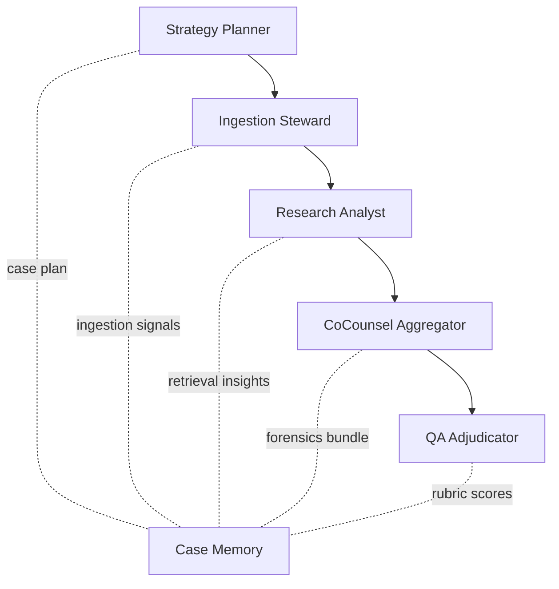
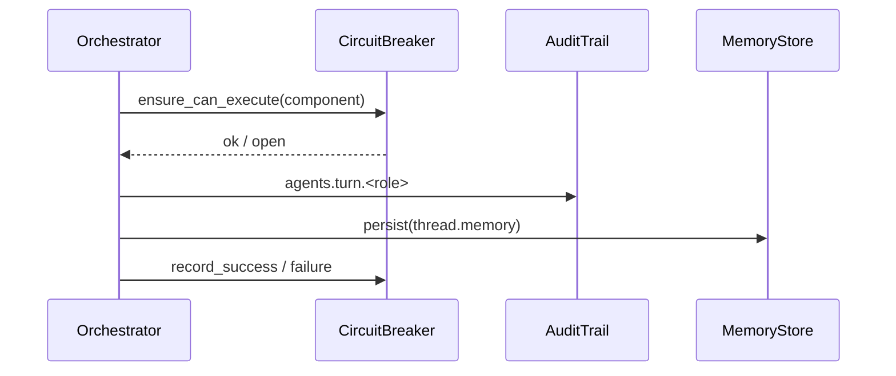

# Microsoft Agents SDK Session Graph Integration

## Overview
This update replaces the bespoke agents pipeline with a Microsoft Agents SDK–style conversation graph. Five TRD roles — Strategy, Ingestion, Research, CoCounsel, and QA — execute as graph nodes with explicit hand-offs, telemetry, and shared memory persisted through `AgentMemoryStore`.

## Session Flow


- **Strategy Planner** derives a stepwise plan and focus entities, seeding the memory `plan` namespace.
- **Ingestion Steward** audits the document store and records coverage statistics under `memory.insights`.
- **Research Analyst** calls the retrieval tool, enriching memory with answer, citations, and traces.
- **CoCounsel Aggregator** links forensics artifacts to citations and updates `memory.artifacts`.
- **QA Adjudicator** evaluates the response with the TRD rubric, storing scores and notes in `memory.qa`.

## Telemetry Contract


Telemetry envelopes now include:
- `turn_roles` and structured `hand_offs` dictionaries capturing `{from, to, via}` transitions.
- `retries` and `backoff_ms` aligned with circuit breakers.
- `qa_average` and rubric notes emitted by the QA tool.

## Memory Structure
```json
{
  "plan": {"objective": "…", "steps": ["…"], "focus_entities": ["…"]},
  "insights": {
    "ingestion": {"document_total": 12, "status": "ready"},
    "retrieval": {"answer": "…", "citations": ["doc-001", "doc-002"]}
  },
  "artifacts": {"artifacts": [{"document_id": "doc-001", "artifact": "document"}]},
  "qa": {"average": 8.7, "scores": {"Technical Accuracy": 9.1}},
  "turns": [{"role": "strategy", "action": "draft_plan", "metrics": {"step_count": 4}}],
  "telemetry": {
    "hand_offs": [
      {"from": "strategy", "to": "ingestion", "via": "ingestion_audit"},
      {"from": "ingestion", "to": "research", "via": "research_retrieval"}
    ]
  }
}
```

## Tool Registry Snapshot
| Agent | Tool | Capability |
|-------|------|------------|
| Strategy | `strategy_plan` | Generates TRD plan and focus entities |
| Ingestion | `ingestion_audit` | Audits document manifests |
| Research | `research_retrieval` | Runs vector + graph retrieval |
| CoCounsel | `forensics_enrichment` | Loads forensics artifacts for citations |
| QA | `qa_rubric` | Scores answer via rubric |

## Operational Notes
- Startup now pre-warms the orchestrator alongside the ingestion worker to reduce first-turn latency.
- Shared memory snapshots are written after every turn (plus finalisation), providing resilient recovery if a component fails mid-conversation.
- Audit hooks remain at the service layer, capturing both turn-level and thread-level events for compliance.
