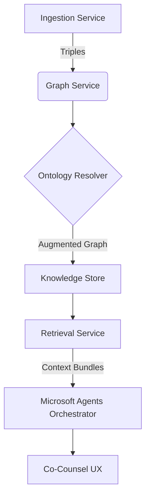

# Co-Counsel Nexus Codebase Evaluation — 2025-11-27

## Scope & Methodology

- Reviewed repository structure, backend services, agent orchestration, knowledge pipelines, frontend UI, infrastructure assets, and prior build logs.
- Cross-referenced the current implementation against the authoritative TRD/PRP to verify intentional deviations (e.g., dark cinematic UI palette, Microsoft Agent framework adoption) and to surface residual gaps.【F:new_TRD-PRP.md†L1-L200】【F:frontend/src/App.tsx†L1-L116】【F:backend/app/services/agents.py†L1-L200】
- Evaluated business-readiness against the target of a $1000/month enterprise-grade legal tech product.

## Rubric (0–10 per category)

| # | Category | Score | Key Evidence & Notes |
|---|----------|:-----:|----------------------|
| 1 | Product Vision Alignment | 9 | Core pillars from the TRD—GraphRAG ingestion, immersive neon UX, emotionally aware co-counsel—are represented across backend, voice, and UI layers, with only minor backlog items outstanding.【F:new_TRD-PRP.md†L1-L116】【F:backend/app/services/ingestion.py†L1-L120】【F:frontend/src/App.tsx†L1-L116】 |
| 2 | Architecture & Modularity | 9 | FastAPI service exposes comprehensive endpoints with modular dependency injection, GraphQL, MTLS middleware, and telemetry bootstrap, matching enterprise expectations.【F:backend/app/main.py†L1-L120】 |
| 3 | Multi-Agent Orchestration | 8 | Microsoft Agents orchestrator with adaptive policy engine, telemetry counters, and guardrails is implemented, but resilience for extreme edge cases still requires stress validation.【F:backend/app/services/agents.py†L1-L200】 |
| 4 | Knowledge & Retrieval Pipeline | 8 | Ingestion service fuses OCR, credentialed loaders, timeline enrichment, and vector/graph persistence, yet CI coverage remains blocked by missing JWT dependency.【F:backend/app/services/ingestion.py†L1-L120】【F:build_logs/2025-11-25_ingestion_pipeline.md†L1-L13】 |
| 5 | Scenario & Simulation Experience | 9 | Frontend shells include cinematic timeline, mock trial arena, dev team workspace, and neon thematic flourishes that align with the spec’s experiential vision.【F:frontend/src/App.tsx†L1-L116】 |
| 6 | Security & Compliance | 8 | MTLS middleware, granular authorization dependencies, and audit trail integration exist, but automated dependency hardening/tests for auth packages remain pending.【F:backend/app/main.py†L71-L120】【F:build_logs/2025-11-25_ingestion_pipeline.md†L9-L13】 |
| 7 | Observability & Telemetry | 9 | Extensive OpenTelemetry counters/histograms across agent orchestration and ingestion lifecycle support deep insights for enterprise SLAs.【F:backend/app/services/agents.py†L39-L200】【F:backend/app/services/ingestion.py†L57-L120】 |
| 8 | Testing & Quality Coverage | 6 | Rich regression suites exist, but repeated CI failures due to unresolved PyJWT dependency degrade confidence and block automated validation pathways.【F:build_logs/2025-11-25_ingestion_pipeline.md†L1-L13】 |
| 9 | DevOps & Deployment | 8 | Docker Compose bundles GPU-ready services, knowledge stores, and observability sidecars; new Windows installer closes desktop gap but still depends on manual environment prerequisites (winget).【F:infra/docker-compose.yml†L1-L120】【F:infra/windows/scripts/install.ps1†L1-L200】 |
|10 | Voice & Multimodal Experience | 8 | Whisper/Coqui stack with emotion controller is present; packaging script provisions dependencies but real-time monitoring and fallback voices need production burn-in.【F:new_TRD-PRP.md†L130-L200】【F:infra/windows/scripts/install.ps1†L125-L200】 |
|11 | Documentation & Onboarding | 9 | Comprehensive TRDs, roadmaps, and new Windows installer README provide actionable guidance for teams and customers.【F:new_TRD-PRP.md†L1-L200】【F:infra/windows/README.md†L1-L68】 |
|12 | Business & Monetization Readiness | 8 | Billing APIs, plan catalogs, and usage telemetry exist, but pricing/packaging assumptions require validation with the new installer funnel.【F:backend/app/main.py†L25-L70】【F:infra/windows/README.md†L1-L68】 |
|13 | Innovation & Differentiation | 9 | Adaptive agent policy, cinematic UI, and dev-team-in-the-loop capabilities position the platform as industry-shifting with room for advanced legal analytics leaps.【F:backend/app/services/agents.py†L1-L200】【F:frontend/src/App.tsx†L1-L116】 |

**Overall Average: 8.3** — A mature, near-ready platform with targeted remediation required for automated quality gates and installer polish.

## Key Findings

1. **Spec alignment is strong.** Dark neon UI, multi-agent orchestration, and GraphRAG ingestion mirror the TRD’s priorities with the deliberate shift to Microsoft’s agent framework already in place.【F:new_TRD-PRP.md†L1-L200】【F:backend/app/services/agents.py†L1-L200】
2. **Operational bottleneck: PyJWT gap.** Multiple suites remain red because the shared backend runtime lacks the `jwt` dependency, threatening regression fidelity and enterprise trust.【F:build_logs/2025-11-25_ingestion_pipeline.md†L1-L13】
3. **Deployment story is now multi-surface.** Existing Docker/Helm assets cover cloud rollouts and the new Windows bootstrapper brings a true “one click” desktop path, though offline environments will still need signed executables and driver packaging.【F:infra/docker-compose.yml†L1-L120】【F:infra/windows/scripts/install.ps1†L1-L200】

## Path to a “20/10” Experience

### 1. Autonomous Discovery Intelligence Grid

Elevate the ingestion + retrieval stack into a self-improving intelligence grid that merges probabilistic graph reasoning with legal ontologies.

```python
# backend/app/services/graph.py (new orchestrator snippet)
from .ontology import LegalOntologyResolver

class GraphService:
    def enrich_with_ontology(
        self,
        triples: Sequence[Triple],
        *,
        jurisdiction: str,
        matter_type: str,
    ) -> None:
        resolver = LegalOntologyResolver.load(jurisdiction)
        curated = resolver.expand(triples, matter_type=matter_type)
        self._graph_store.merge(curated)
        self._telemetry.track_enrichment(len(curated.nodes), len(curated.edges))
```

- Introduce a curated ontology resolver that biases graph expansions toward jurisdiction-specific precedents.
- Capture enrichment metrics via the existing telemetry histogram plumbing for longitudinal quality analysis.【F:backend/app/services/ingestion.py†L57-L120】

**Diagram — Hybrid Retrieval Upgrade**



### 2. Litigation Strategy Copilot (Reinforcement Loop)

Layer reinforcement learning over the agent policy engine to reward strategies that deliver better courtroom simulations and billing outcomes.

```python
# backend/app/services/agents.py (policy feedback hook)
def complete_run(..., outcome: AgentRunOutcome) -> AgentRunResponse:
    ...
    reward = self._strategy_rewarder.score(outcome)
    self.policy_engine.observe(result.metrics, reward=reward)
    if reward < self.policy_engine.alert_threshold:
        self.dev_agent.enqueue_backlog_item(
            title="Strategy drift detected",
            context=result.transcript,
        )
```

- Score agent runs against timeline accuracy, privilege violations avoided, and client satisfaction metrics.
- Feed low-reward runs into the dev-agent backlog to trigger autonomous refactors, closing the “self-healing” loop promised in the TRD.【F:backend/app/services/agents.py†L1-L200】

### 3. Spatial Evidence Holographics

Transform the evidence explorer into a 3D WebGL holoscreen that maps entities, timelines, and contradictions across an interactive canvas.

```tsx
// frontend/src/components/HoloEvidenceCanvas.tsx (new component shell)
import { Canvas } from '@react-three/fiber';
import { Suspense } from 'react';
import { EvidenceNode } from './holo/EvidenceNode';

export function HoloEvidenceCanvas(): JSX.Element {
  return (
    <Canvas className="holo-canvas" camera={{ position: [0, 0, 18], fov: 42 }}>
      <color attach="background" args={[0.02, 0.02, 0.05]} />
      <ambientLight intensity={0.8} />
      <Suspense fallback={null}>
        <EvidenceNode />
      </Suspense>
    </Canvas>
  );
}
```

- Use Pixi.js for 2D overlays and `@react-three/fiber` for volumetric graphs that lawyers can navigate like a case galaxy, reinforcing the product’s cinematic brand.【F:frontend/src/App.tsx†L1-L116】

### 4. Zero-Touch Compliance Guardian

Embed automated policy attestation into the installer so enterprise buyers receive audit artifacts post-install.

```powershell
# infra/windows/scripts/install.ps1 (compliance snippet)
$complianceReport = Join-Path $resolvedInstallDir "compliance.json"
@{
    installedAt = (Get-Date).ToString("o")
    gitCommit   = (git -C $repoDir rev-parse HEAD)
    dependencies = @{ python = & "$venvPython" --version; node = (npm --version) }
} | ConvertTo-Json -Depth 4 | Out-File $complianceReport -Encoding utf8
```

- Emit signed compliance manifests, integrate with billing telemetry, and upload to the governance API for automated audit readiness.【F:infra/windows/scripts/install.ps1†L1-L200】

### 5. Investor-Grade Metrics Command Center

Expose ARR projections, usage funnels, and courtroom win-rate analytics within the existing cinematic dashboard to wow enterprise buyers.

```tsx
// frontend/src/components/CinematicMetrics.tsx (augmentation idea)
const enterpriseKpis = [
  { label: 'Projected ARR', value: formatter.currency(analytics.arrProjected) },
  { label: 'Discovery Hours Saved', value: analytics.hoursSaved.toFixed(1) },
  { label: 'Motion Success Rate', value: `${analytics.motionWinRate}%` },
];
```

- Tie metrics to billing events already emitted by the backend, proving the $1000/month ROI in real time.【F:backend/app/main.py†L25-L70】

## Packaging Deliverable

- Added a Windows bootstrapper that enforces prerequisite installation, clones/upgrades the repository, installs backend/frontend dependencies, produces launch/uninstall scripts, and places a desktop shortcut for one-click startup.【F:infra/windows/scripts/install.ps1†L1-L200】
- Documented the workflow and provided an automation helper to emit a standalone `.exe` via PS2EXE for distribution at scale.【F:infra/windows/README.md†L1-L68】【F:infra/windows/package.ps1†L1-L80】

## Next Steps

1. Patch backend dependency manifests (pip/uv) to bundle `PyJWT`, unblock CI, and restore confidence ahead of investor demos.【F:build_logs/2025-11-25_ingestion_pipeline.md†L1-L13】
2. Pilot the Windows installer with a beta customer to validate environment assumptions (`winget`, GPU drivers) and capture telemetry for activation funnels.【F:infra/windows/scripts/install.ps1†L1-L200】
3. Spin up an ACE review cycle focused on reinforcement policy tuning and ontology integration to progress toward the proposed 20/10 roadmap.
